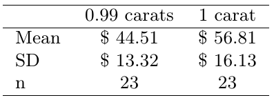
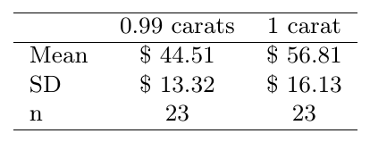
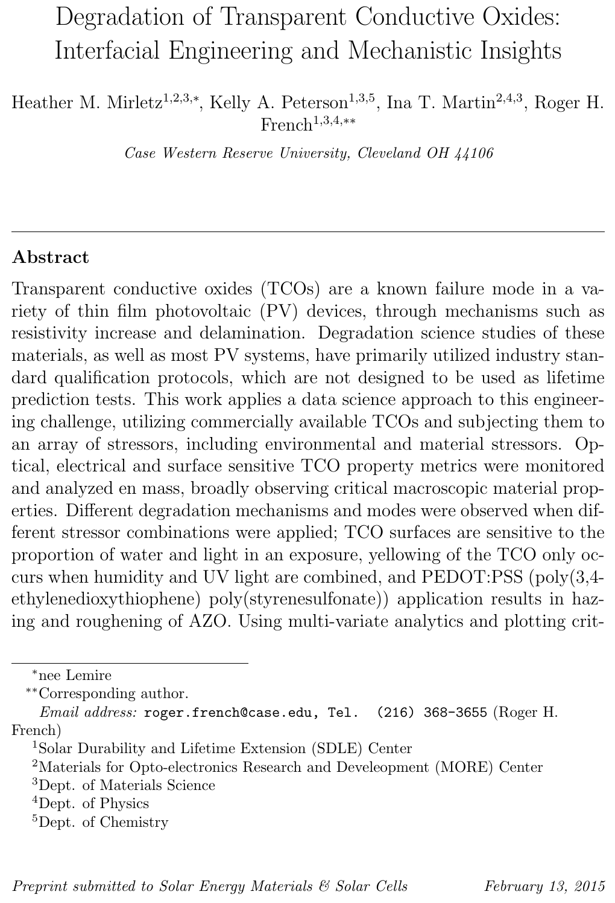
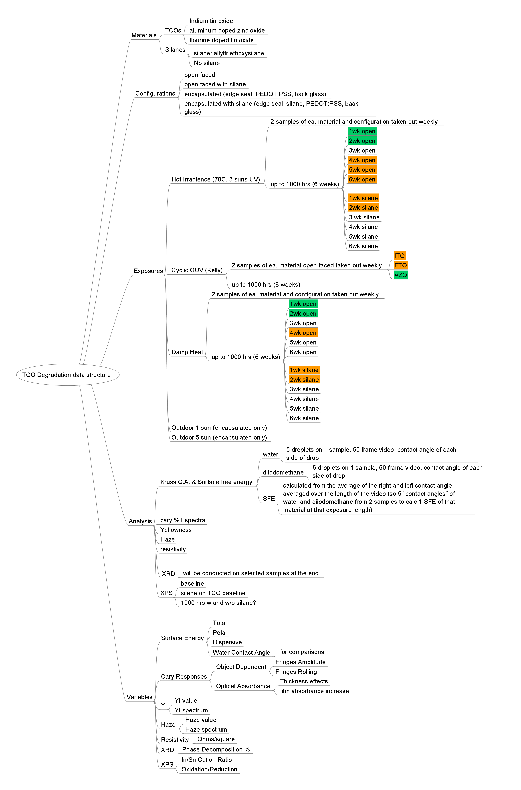
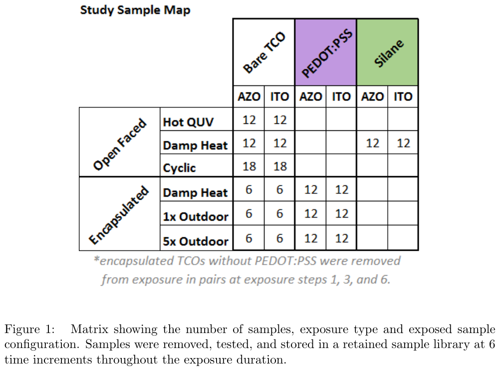
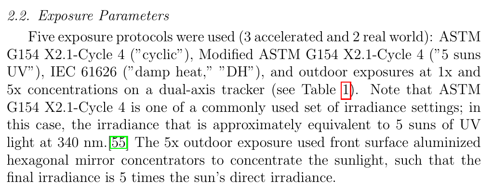
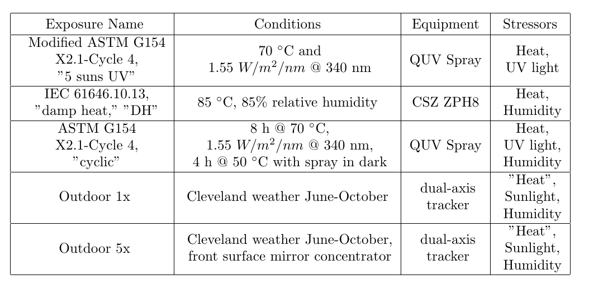

<!-- ioslides themese: "cerulean", "journal", "flatly", "readable", "spacelab", "united", "cosmo" -->

## Final Exam (20 pts)  

  - Will be held Monday 12/17/2018 from Noon - 3 pm
  - Comprehensive over the course
  - This is open book, open resource test
  - Done as Rmd file to turn in
  - Zip up your Final Exam folder and turn it in on blackboard
  
Final exam questions  
  - OI Stats questions
  - Data Analysis: Tidying, EDA
  - Essay Question
  - Do a exploratory data analysis on Degradation of Transparent Conductive Oxides
  
You have a pdf of OIStats book 

  - In your 3-readings folder of your Repo

# Hypothesis Test Diamond Prices  (3pts)

OIStats 5.28 Diamonds, Part I. 

Prices of diamonds are determined by what is known as the 4 Cs: 

  - cut,clarity, color, and carat weight. 
 
The prices of diamonds go up 

  - as the carat weight increases, 
  - but the increase is not smooth. 

For example, the difference between 

  - the size of a 0.99 carat diamond 
    - and a 1 carat diamond is undetectable to the naked human eye, 
  - but the price of a 1 carat diamond tends to be much higher 
    - than the price of a 0.99 diamond. 

In this question we use two random samples of diamonds, 

  - 0.99 carats and 1 carat, 
    - each sample of size 23, 
  - and compare the average prices of the diamonds. 

In order to be able to compare equivalent units, 

  - we first divide the price for each diamond 
  - by 100 times its weight in carats. 

That is, 

  - for a 0.99 carat diamond, 
    - we divide the price by 99. 
  For a 1 carat diamond, 
    - we divide the price by 100. 
    
The distributions and some sample statistics 

  - are shown in Figure 1, and 2.




Conduct a hypothesis test 

  - to evaluate if there is a difference between 
    - the average standardized prices 
    - of 0.99 and  1 carat diamonds. 

Make sure to 

  - state your hypotheses clearly, 
  - check relevant conditions, and 
  - interpret your results in context of the data.
  -  use good code style


```{r}
# Answer goes here:

```

# 95% Confidence Intervals for Diamond Prices (3pts)

OIStats 5.30 Diamonds, Part II.

In Exercise 5.28, we discussed diamond prices 

  - (standardized by weight) 
  - for diamonds with weights 0.99 carats and 1 carat. 

See the table for summary statistics (Figure 3), and

  - then construct a 95% confidence interval for the average difference 
    - between the standardized prices of 0.99 and 1 carat diamonds. 
  - You may assume the conditions for inference are met.



```{r}
# Answer goes here:

```

# Visualizing Anscombe's Quartet of ‘Identical’ Simple Linear Regressions (3pts)

Four x-y datasets which have the same traditional statistical properties 

  - (mean, variance, correlation, regression line, etc.), 
  - yet are quite different.

The anscombe quartet is available in R, 

  - and they even give code to plot it.  
  
But for this problem 

 - you should make your own code for visualization.

Using the Anscombe quartet, 

  - demonstrate the differences in these four datasets 
  - using different plots and approaches to visualize them. 

Use ggplot for your visualizations.  

```{r}
# Answer goes here:

```

# What is data science? (5 paragraph essay with citations) (4pts)

What is Data Science

  - What do you find most interesting or exciting about data science and EDA? 
  - What defines data science and how has it come about.  
  - What are its characteristics, and what are the elements of 
    - a data science tool chain, 
    - a data science pipeline, and 
    - a data analysis.  

Use the structure of a 5 paragraph essay 

  - Introduction, 
  - 3 topic paragraphs, 
  - 1 concluding paragraph) with citations/references.  

-------------------------------------------------
Essay Answer goes here

-------------------------------------------------

# EDA of TCO degradation (7pts)

## This problem will be similar to 

This problem will be similar to 

  - Proj1 on Degradation of Hard Coat Acrylics. 
  - But you are given a csv file of a clean and tidy data set.

You will need to 

  - do EDA and 
    - make figures 
    - and summaries of what you find.

And list the insights you can develop from your EDA.

## TCO's are transparent conductive oxides

TCO's are transparent conductive oxides

  - Such as the materials ITO, AZO and FTO.
  - They are used in displays, televisions, phones, photovoltaics etc. 

Heather Lemire Mirletz did her MS thesis on TCO degradation

  - And has a journal paper published.

Figure 4 is the abstract of the paper



Figure 5 is a mindmap showing the structure of her data science study

  - there is a pdf of this mindmap in the tco-degr data folder.



Figure 6 gives information on the samples studied and the exposures used



Figure 7 is information about the exposure parameters used for the samples



And a table about the exposure conditions



The tco-degr csv datafile is located 

  - in the tco-degr subfolder 
    - of the FinalExam
  - it consists of 771 observations of 23 variables 

Some questions to try to address, showing your results.

  - Which type of TCO (ITO, AZO, FTO) is most stable?
  - Which type of Exposure is most aggressive?
  - How do 'open' vs. 'encapsulated' samples compare.

What other insights 

  - can you identify and demonstrate 
  - from your EDA?

```{r}
# Answer goes here:

```

