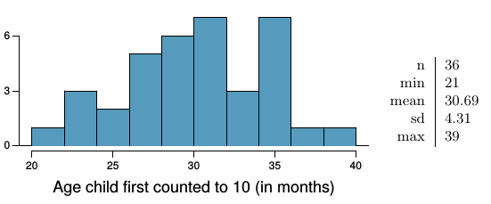
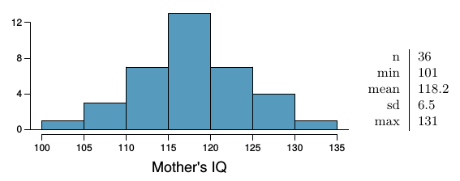
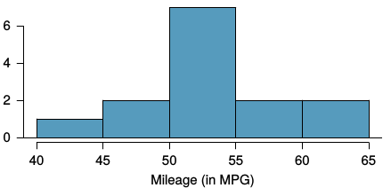
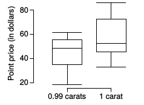
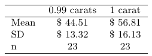

<!--
# Script Name: 1708cwru-dsci351-451-NAME.Rmd
# Purpose: This is a blank Rmd file to start a new open science data analysis from
# Authors: Roger H. French
# License: Creative Commons Attribution-ShareAlike 4.0 International License.
##########
# Latest Changelog Entires:
# v0.00.01 - 1501cwru-dsci-NAMEIT.RMD - Roger French started this blank Rmd
##########

# Rmd code goes below the comment marker!
-->


\setcounter{section}{5}
\setcounter{subsection}{0}
\setcounter{subsubsection}{0}

Inference Guide

There is a useful Inference Cheat Sheet in your readings folder

  - os2_extra_inference_guide.pdf
  
There is Hadley Wickham's book on ggplot in your readings textboosk folder

  - Elegant Graphics for Data Analysis [@wickham_ggplot2:_2016]
  

#### 1) Twitter users and News

##### Part I. (OIS 4.8) 

A poll conducted in 2013 found that 

  - 52% of U.S. adult Twitter users get at least some news on Twitter.[@mitchell_twitter_2013] 
  - The standard error for this estimate was 2.4%, 
    - and a normal distribution may be used to model the sample proportion. 

Construct a 99% confidence interval for 

  - the fraction of U.S. adult Twitter users 
  - who get some news on Twitter, 
  
and interpret the confidence interval in context.

```{r}

```

Answer:  

##### Twitter users and news, Part II. (OIS 4.10) 

Identify each of the following statements as true or false. 
Provide an explanation to justify each of your answers.

(a) The data provide statistically significant evidence that 

  - more than half of U.S. adult Twitter users 
    - get some news through Twitter. 
  - Use a significance level of $\alpha$ = 0.01.

Answer: 

(b) Since the standard error is 2.4%, 

  - we can conclude that 97.6% of all U.S. adult Twitter users
    - were included in the study.
    
Answer: 
    
(c) If we want to reduce the standard error of the estimate, 

  - we should collect less data.

Answer: 

(d) If we construct a 90% confidence interval 

  - for the percentage of U.S. adults Twitter users 
    - who get some news through Twitter, 
  - this confidence interval will be wider 
    - than a corresponding 99% confidence interval.

Answer: 

#### 4.24 Gifted children, 

##### Part I. (OIS 4.24)

Researchers investigating characteristics of gifted children 

  - collected data from schools in a large city 
    - on a random sample 
  - of thirty-six children 
    - who were identified as gifted children 
    - soon after they reached the age of four. 

The following histogram shows 

  - the distribution of the ages (in months) 
  - at which these children first counted to 10 successfully. 
  
Also provided are some sample statistics.[@graybill_regression_1994]



(a) Are conditions for inference satisfied?

Answer: 

(b) Suppose you read online that children 

  - first count to 10 successfully when they are 32 months old, on average. 
  
Perform a hypothesis test to evaluate 

  - if these data provide convincing evidence that 
  - the average age at which gifted children fist count to 10 successfully 
    - is less than the general average of 32 months. 
  - Use a significance level of 0.10.

Answer: 
  
(c) Interpret the p-value in context 

  - of the hypothesis test 
  - and the data.
  
Answer: 
  
(d) Calculate a 90% confidence interval 

  - for the average age at which gifted children 
    -  first count to 10 successfully.

Answer: 

(e) Do your results from 

  - the hypothesis test and 
  - the confidence interval agree? 
  
Explain.

Answer: 


##### Part II. (OIS 4.26)

4.26 Gifted children, Part II. Exercise 4.24 describes a study on gifted children. 

In this study, along with variables on the children, 

  - the researchers also collected data 
    - on the mother’s and father’s IQ 
    - of the 36 randomly sampled gifted children. 
    
The histogram below shows the distribution of mother’s IQ. 
Also provided are some sample statistics.



(a) Perform a hypothesis test 

  - to evaluate if these data provide convincing evidence 
    - that the average IQ of mothers of gifted children 
  - is different than the average IQ for the population at large,
    - which is 100. 
  - Use a significance level of 0.10.

Answer: 

(b) Calculate a 90% confidence interval 

  - for the average IQ of mothers of gifted children.
  
Answer: 

(c) Do your results from 

  - the hypothesis test 
  - and the confidence interval agree? 
  
Explain.

Answer: 

#### Spray Paint (OIS 4.42)

Suppose the area that can be painted using a single can of spray paint 

  - is slightly variable 
  - and follows a nearly normal distribution 
    - with a mean of 25 square feet 
    -  and a standard deviation of 3 square feet.
    
(a) What is the probability that 

  - the area covered by a can of spray paint 
  - is more than 27 square feet?
  
Answer: 
  
(b) Suppose you want to spray paint 

  - an area of 540 square feet 
  - using 20 cans of spray paint. 

On average, how many square feet 

  - must each can be able to cover 
  - to spray paint all 540 square feet?

Answer: 

(c) What is the probability 

  - that you can cover a 540 square feet area 
  - using 20 cans of spray paint?

Answer: 

(d) If the area covered by a can of spray paint 

  - had a slightly skewed distribution, 
  - could you still calculate the probabilities in parts (a) and (c) 
    - using the normal distribution?

Answer: 

#### Fuel efficiency of Prius. (OIS 5.8)

[Fueleconomy.gov](http://www.fueleconomy.gov/), 

  - the official US government source 
    - for fuel economy information, 
  - allows users to share gas mileage information on their vehicles. 
  
The histogram below shows 

  - the distribution of gas mileage in miles per gallon (MPG) 
    -  from 14 users who drive a 2012 Toyota Prius. 
  - The sample mean is 53.3 MPG 
    - and the standard deviation is 5.2 MPG. 
  
Note that these data are user estimates 

  - and since the source data cannot be verified, 
  - the accuracy of these estimates are not guaranteed.[@noauthor_gas_nodate]



(a) We would like to use these data to evaluate 

  - the average gas mileage of all 2012 Prius drivers.

Do you think this is reasonable? 

  - Why or why not? 

Answer: 

(b) The EPA claims that a 2012 Prius gets 50 MPG 

  - (city and highway mileage combined). 
  
Do these data provide strong evidence against this estimate 

  - for drivers who participate on fueleconomy.gov? 
  - Note any assumptions you must make as you proceed with the test.

Answer: 

(c) Calculate a 95% confidence interval 

  - for the average gas mileage of a 2012 Prius 
  - by drivers who participate on fueleconomy.gov.

Answer: 


#### Diamonds 

##### Diamonds Part I. (OIS 5.28)

Prices of diamonds are determined by what is known as the 4 Cs:

  - cut,
  - clarity, 
  - color, 
  - and carat weight. 
  
The prices of diamonds go up 

  - as the carat weight increases, 
  -  but the increase is not smooth. 
  
For example, the difference between the size 

  - of a 0.99 carat diamond and 
    - a 1 carat diamond is undetectable to the naked human eye, 
  - but the price of a 1 carat diamond tends to be much higher 
    - than the price of a 0.99 diamond. 
  
In this question we use two random samples of diamonds, 

  - 0.99 carats and 1 carat, 
  - each sample of size 23, 
  
and compare the average prices of the diamonds. 

In order to be able to compare equivalent units, 

  -we first divide the price for each diamond 
  - by 100 times its weight in carats. 
  
That is, for a 0.99 carat diamond, we divide the price by 99. 

For a 1 carat diamond, we divide the price by 100. 

The distributions and some sample statistics are shown below.[@wickham_ggplot2:_2016]





(a) Conduct a hypothesis test to evaluate 

  - if there is a difference between the average standardized prices 
  - of 0.99 and  1 carat diamonds. 

Make sure to 

  - state your hypotheses clearly, 
  -  check relevant conditions, 
  - and interpret your results in context of the data.
 
Answer:

##### Diamonds Part II. (OIS 5.30)

We discussed diamond prices

  - (standardized by weight) 
  -  for diamonds with weights 0.99 carats and 1 carat. 
  
See the table for summary statistics,

  - and then construct a 95% confidence interval 
  - for the average difference 
    - between the standardized prices of 0.99 and 1 carat diamonds. 

You may assume the conditions for inference are met.

Answer: 


#### Links
 
[http://www.r-project.org](http://www.r-project.org) 

[http://rmarkdown.rstudio.com/](http://rmarkdown.rstudio.com/)  

[https://www.openintro.org/stat/textbook.php?stat_book=os](https://www.openintro.org/stat/textbook.php?stat_book=os)

#### References 


<!--
# Keep a complete change log history at bottom of file.
# Complete Change Log History
# v0.00.00 - 1405-07 - Nick Wheeler made the blank script
##########
Here are standard YAML Headers for Rmarkdown/Markdown/PanDoc
  1. Beamer slides and PDF Report, html
  2. html and PDF report as full long pages
  3.ioSlides slides and PDF report. ioSlides is buggy, not well supported, but looks nice. 

---
title: "Test Presentation"
author: Nick Wheeler
date: January 19, 2015
output:
  html_document:
    toc: true
    font-size: 10em
    self_contained: true
  ioslides_presentation:
    toc: true
    self_contained: true
    smaller: true
  beamer_presentation:
    toc: true
  pdf_document:
    toc: true
---

-->