 
 \setcounter{section}{4}
 \setcounter{subsection}{1}
 \setcounter{subsubsection}{2}
 
 <!-- 
 How to make comments inside Rmarkdown
# Script Name: PET Degradation EDA, Fall 2016
# Purpose: This is a template Rmd file to start a new class from
# Authors: Roger H. French, Abdulkerim Gok
# License: Creative Commons Attribution-ShareAlike 4.0 International License.
##########
# Latest Changelog Entires:
# v0.00.01 - Filename.Rmd - Roger French started this blank Rmd script
--> 

<!-- Or on a single line like this -->
 

```{r setup, include=FALSE}
knitr::opts_chunk$set(echo = TRUE)
```

#### Degradation of Polyester Films

  - This is a Materials Data Science Study
  - A Journal Article by Gok
  - Is located in 3-readings folder of your class repo
    - "Gok et al. - 2017 - Predictive models of poly(ethylene-terephthalate).pdf" 
  - And the data set is summarized in 2-class/data
    - "PetDegr-DataFrameColumnDefinitions.pdf"

#### Study Design and Protocol

##### Samples 

  Three PET grades used in this study are
  
  - Unstabilized PET: Melinex 454 (3 mil)
  - UV stabilized PET: Tetoron HB3 (2 mil)
  - Hyrolytically stabilized PET: Mitsubishi 8HL1 (5 mil)

##### Exposures

  Four different acceleated weathering exposures were applied:
  
  Exposure           | Condition
  ------------------ | ---------------------------------------------------------------------
  Continuous UVA     | Constant exposure of 1.55 $W/m^{2}$ at 340nm at 70^o^C 
  ASTM G154-4        | Cyclic exposure of 8 hours of UVA light at 1.55 $W/m^{2}$ at 340nm at 70^o^C 
                     |  and 4 hours of condensing humidity at 50^o^C in the dark
  Damp Heat          | Constant exposure 85^o^C / 85\% RH exposure per IEC 61215  
  Humidity Freeze    | Cyclic exposure of 70^o^C / 85\% RH and -40^o^C per IEC 61215

##### Evaluations

  Three evaluation techniques are:
  
  - $L^*a^*b^*$ color, Yellowness index (YI) and Haze (\%) measurements using Hunterlabs UltrascanPro
  - Optical absorbance measurements (abs) using Cary 6000i with DRA 
  - IR spectra measurements using Agilent 630 FTIR with Diamond ATR 
  
  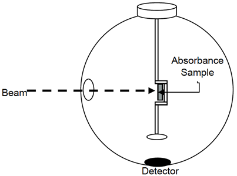

#### Raw Data

  An example of raw spectra that comes right out of the instrument  
  
  - Note the saturation of Absorbance for wavelengths below 300 nm
  
  
  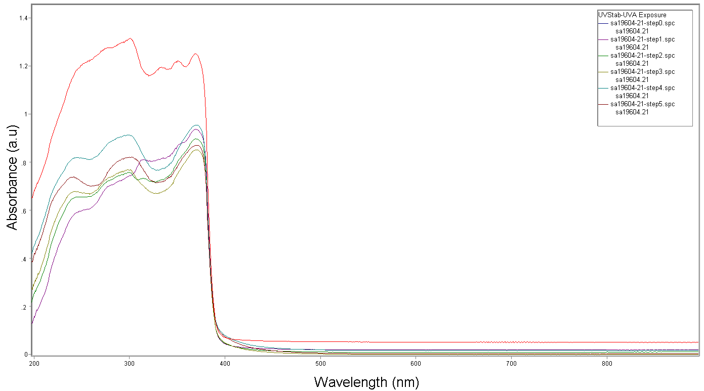

##### Raw Data

  An example of raw spectra that comes right out of the instrument  
  
  - Note the saturation of Absorbance for wavelengths below 300 nm
  
  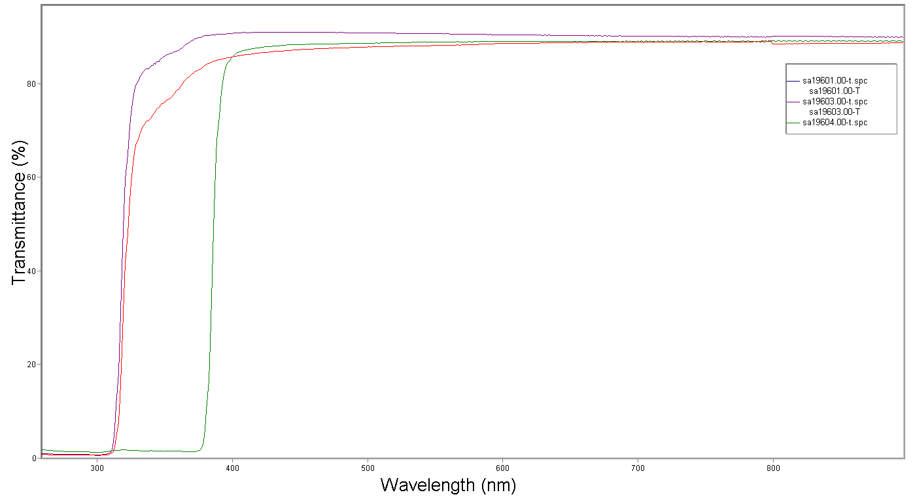

##### Raw Data

  An example of raw spectra that comes right out of the instrument  
  
  - Note the saturation of Absorbance for wavelengths below 300 nm
  
  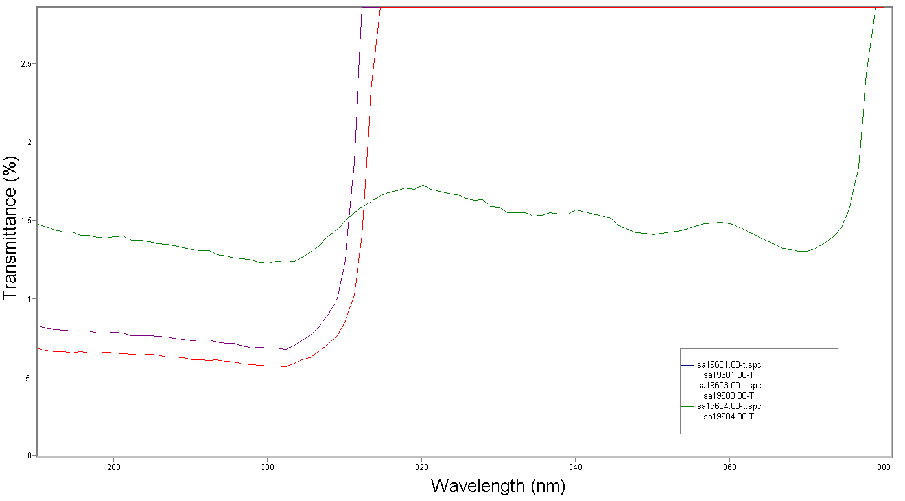


#### Processing Data

  - Absorbance is first normalized to thickness (abs/cm)
    - Then zero correction is applied between 600 and 800 nm 
  - Average Induced absorbance to dose is calculated from corrected **abs/cm**
    - Negative IAD is photobleaching
    - Positive IAD is photodarkening

  <center> $\tfrac {Abs}{cm} per \tfrac {GJ}{m^2} = aIAD = \tfrac {Abs_i(\lambda)-Abs_0(\lambda))}{Dose_i-Dose_0}$     

##### Point-in-Time Data

  Single values are extracted from spectra
  
  - YI and Haze are already obtained directly from instruments   
    
  Single abs/cm values are extracted from spectra at specific wavelengths   
  
  - Fundamental absorption edge at ~300 nm    
  - Features associated with UV stabilizer at 335 nm, 350 nm, and 370 nm    
  - Optical density at 400 nm related to yellowing 
  - Single aveIAD values are also extracted at the same wavelengths   

##### Point in Time Data {.smaller}

  Single values are extracted from spectra
  
  - Zero absorbance correction applied for FTIR between 4000-3500 cm^-1^ to remove offset
  
    - Single IR peak heights are extracted at specific wavenumbers
        - 714 cm^-1^ and 1017 cm^-1^ for out of plane and in plane vibration of benzene
        - 872 cm^-1^ and 1341 cm^-1^ for CH~2~ rocking and wagging of glycol
        - 1093 cm^-1^, 1251 cm^-1^, and 1716 cm^-1^ for ester C=O stretching
    - Due to shifts in peak position, maximum data point is pulled as the single data point in some range for the corresponding peaks
        - i.e., for the 1716 cm^-1^ data point, the maximum between 1700 cm^-1^ and 1730 cm^-1^ is extracted.

#### Data Structure Build the data frame for analysis

  All data put together in one data frame
  
  - Samples entered as rows and variables as columns: 
    - Sample and exposure information (type, time and step size, irradiation and dose content, etc.)
    - Cyclic exposure conditions (rate of change from one state to another) for further modelling purposes
    - Spectral information, point in time, extracted from spectra
    - Spectra from UV-Vis (abs/cm) and IR also included.


##### Data Structure {.smaller}

  Introducing data frame:

```{r}
  dat <- read.csv("../2-class/data/PetDegr-DataFrame-v05-singles.csv")
  names(dat)
```

<!-- This is for uncommenting a line -->

##### Data Structure {.smaller}

```{r}
  str(dat)
```


##### Data Structure {.smaller}
Introducing data frame:

```{r}
  head(dat)[1:8]
  
  tail(dat)[1:8]
```


#### Data Subsetting {.smaller}

Since we have three different materials

```{r}
  library(dplyr)
  
  unstab <- filter(dat, Material == 'Unstab')
  # unstab <- dat[which(dat$Material=="Unstab"), ]
  
  uvstab <- filter(dat, Material == 'UVStab')
  # uvstab <- dat[which(dat$Material=="UVStab"), ]
  
  hystab <- filter(dat, Material == 'HydStab')
  # hystab <- dat[which(dat$Material=="HydStab"), ]

```

You can also use "subset" function to subset your data  

```{r}
  unstab.dh2 <- subset(dat, Material == "Unstab" & Exposure == "DampHeat")
  
  uvstab.hq2 <- subset(dat, Material == "UVStab" & Exposure == "HotQUV")
  
  hystab.ft2 <- subset(dat, Material == "HydStab" & Exposure == "FreezeThaw")

```


##### Data Subsetting {.smaller}

  Since we have four different exposures

```{r}
# Exposures for Unstabilized

  unstab.dh <- filter(unstab, Exposure == "DampHeat")
  unstab.ft <- filter(unstab, Exposure == "FreezeThaw")
  unstab.hq <- filter(unstab, Exposure == "HotQUV")
  unstab.cq <- filter(unstab, Exposure == "CyclicQUV")
  # unstab.dh <- unstab[which(unstab$Exposure=="DampHeat"), ]
  # unstab.ft <- unstab[which(unstab$Exposure=="FreezeThaw"), ]
  # unstab.hq <- unstab[which(unstab$Exposure=="HotQUV"), ]
  # unstab.cq <- unstab[which(unstab$Exposure=="CyclicQUV"), ]

# Exposures for UV stabilized
 
  uvstab.dh <- filter(uvstab, Exposure == "DampHeat")
  uvstab.ft <- filter(uvstab, Exposure == "FreezeThaw")
  uvstab.hq <- filter(uvstab, Exposure == "HotQUV")
  uvstab.cq <- filter(uvstab, Exposure == "CyclicQUV")
  # uvstab.dh <- uvstab[which(uvstab$Exposure=="DampHeat"), ]
  # uvstab.ft <- uvstab[which(uvstab$Exposure=="FreezeThaw"), ]
  # uvstab.hq <- uvstab[which(uvstab$Exposure=="HotQUV"), ]
  # uvstab.cq <- uvstab[which(uvstab$Exposure=="CyclicQUV"), ]

# Exposures for UV stabilized

  hystab.dh <- filter(hystab, Exposure == "DampHeat")
  hystab.ft <- filter(hystab, Exposure == "FreezeThaw")
  hystab.hq <- filter(hystab, Exposure == "HotQUV")
  hystab.cq <- filter(hystab, Exposure == "CyclicQUV")
  # hystab.dh <- hystab[which(hystab$Exposure=="DampHeat"), ]
  # hystab.ft <- hystab[which(hystab$Exposure=="FreezeThaw"), ]
  # hystab.hq <- hystab[which(hystab$Exposure=="HotQUV"), ]
  # hystab.cq <- hystab[which(hystab$Exposure=="CyclicQUV"), ]

```


#### Simple Plotting with base graphics, "Plot", Function {.smaller}

  Let's plot YI as a function of Time for Unstabilized in DampHeat exposure

<center>
```{r, fig.width=5, fig.height=5, message=FALSE}
  plot(unstab.dh$Time, unstab.dh$YI)
```


##### Simple Plotting with "Plot" Function {.smaller}

  <center>
```{r, fig.width=4.5, fig.height=4.5, message=FALSE}
  plot(unstab.dh$Time, unstab.dh$YI, main = "Change in YI with Time for Unstabilized in
       DampHeat Exposure", xlab = "Time(hrs)", ylab = "Yellowness Index", pch = 19)
  abline(lm(unstab.dh$YI~unstab.dh$Time), col = "red")         # Regression line (YI~Time)

```

  An example of plotting from the main dataframe. 
  
  - This is a cleaner way of organizing and plotting data 
  - as it does not depends on a large number of environmental dataframes.

```{r, fig.width=4.5, fig.height=4.5, message=FALSE}
  library(ggplot2)
  
  dat %>%
    filter(Material == "Unstab" & Exposure == "DampHeat") %>%
    ggplot(aes(x = Time, y = YI)) + 
    geom_point(color = 'red', pch = 19) +
    geom_smooth(method = 'lm', se = FALSE) +
    labs(xlab = "Time(hrs)", ylab = "Yellowness Index", title = "Change in YI with Time for Unstabilized in DampHeat Exposure") +
    theme(plot.title = element_text(size = 10))

```

##### Simple Plotting with "Plot" Function {.smaller}

  Another example: Plot of haze as a function of Time for Hydstab in CyclicQUV

<center>
```{r, fig.width=4.5, fig.height=4.5, message=FALSE}

  plot(hystab.cq$Time, hystab.cq$Haze, main = "Change in Haze with Time for Hyd. stabilized in CyclicQUV Exposure", xlab = "Time(hrs)", ylab = "Haze(%)", pch = 19, col = "red")
  
  abline(lm(hystab.cq$Haze~hystab.cq$Time), col = "blue")         # Regression line (YI~Time)
```


#### Pairwise plots {.smaller}

  <center>
```{r, fig.width=10, fig.height=5, message=FALSE} 
  pairs(~Time+YI+Haze+abs300+abs400+iad300+iad400, 
        data = uvstab.hq, main = "Pairwise plot for UVstabilized in HotQUV Exposure")
```

##### Pairwise plots {.smaller}

```{r, echo=FALSE, fig.width=5, fig.height=5, message=FALSE} 
  library(GGally)  # Another way of pairwise plotting using ggpairs with correlation coeff's
```

```{r, fig.width=5, fig.height=5, message=FALSE}
  ggpairwise <- ggpairs(uvstab.hq[,c(6,13,14,15,20,21,26)], title = "Pairwise plot with correlation coeff's for UVstabilized in HotQUV Exposure")
```

  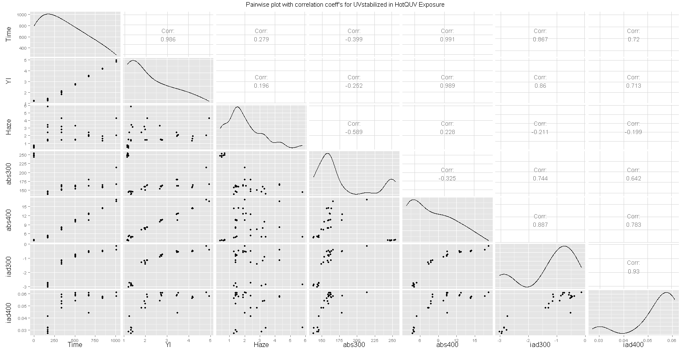


#### Plotting with "ggplot" function for advanced plots {.smaller}

```{r, fig.width=5, fig.height=5, message=FALSE} 
library(ggplot2)
??ggplot2

# if (!require("bear")) install.packages("bear");
# library(bear)   # bear package no longer exists
# ??bear 

# if (!require("plotrix")) install.packages("plotrix");
# library(plotrix)   
# ??plotrix 


# SummarySE function for standard error
# have to rework this to get the standard error with either plotrix of 
# unstab.yi <- std.error(unstab::YI, measurevar="YI", groupvars=c("Time", "Exposure"))
# unstab.haze <- std.error(unstab, measurevar="Haze", groupvars=c("Time", "Exposure"))

# ggplot of unstabilized-YI

# eda <- ggplot(unstab.yi, aes(x=Time, y=YI, group=Exposure, colour=Exposure)) + 
#   geom_errorbar(aes(ymin=YI-se, ymax=YI+se), 
#                 colour="black", size=1, width=5) +
#   geom_line(size=1) +
#   geom_point(size=3, shape=21, fill="black") +
#   theme_bw() +
#   #geom_text(aes(label=N, hjust=1, vjust=2)) +
#   #scale_y_continuous(limits=c(0, 10)) +
#   ggtitle(paste("Change in Yellowness Index (YI) with Time")) +
#   xlab("Time (hrs)") +
#   ylab("Yellowness Index") +
#   theme(legend.position = c(0.25,0.80), legend.title = element_blank(), 
#         legend.text = element_text(size=13, face="bold"),
#         legend.key = element_blank(), axis.text=element_text(size=13,face="bold"),
#         axis.title=element_text(size=13,face="bold"), 
#         plot.title=element_text(size=13,face="bold"))

```


##### Plotting with "ggplot" function for advanced plots {.smaller}

<center>
```{r, fig.width=4.5, fig.height=4.5, message=FALSE} 
# print(eda)

```


#### Standard deviation, standard error, and 95% confidence interval  

Subsetting data for baseline measurements for each material type
```{r}

# Subset data for time zero

  unstab.0 <- filter(dat, Material == "Unstab" & Time == "0")
  uvstab.0 <- filter(dat, Material == "UVStab" & Time == "0")
  hystab.0 <- filter(dat, Material == "HydStab" & Time == "0")

# unstab.0 <- subset(dat, Material=="Unstab" & Time=="0")
# uvstab.0 <- subset(dat, Material=="UVStab" & Time=="0")
# hystab.0 <- subset(dat, Material=="HydStab" & Time=="0")
```

Just as an example
```{r}
  head(unstab.0)[1:8]
```


##### Standard deviation, standard error, and 95% confidence interval {.smaller} 
For yellowness index measurement for each material
```{r}
# For YI at Time=0 for unstabilized
# unstab.yi.unc <- summarySE(unstab.0, measurevar="YI", groupvars="Time")
# print(unstab.yi.unc)

# For YI at Time=0 for UVstabilized
# uvstab.yi.unc <- summarySE(uvstab.0, measurevar="YI", groupvars="Time")
# print(uvstab.yi.unc)

# For YI at Time=0 for Hyd.stabilized
# hystab.yi.unc <- summarySE(hystab.0, measurevar="YI", groupvars="Time")
# print(hystab.yi.unc)
```


##### Standard deviation, standard error, and 95% confidence interval {.smaller}
For haze measurement for each material

```{r}
# For Haze at Time=0 for unstabilized
# unstab.haze.unc <- summarySE(unstab.0, measurevar="Haze", groupvars="Time")
# print(unstab.haze.unc)

# For Haze at Time=0 for UVstabilized
# uvstab.haze.unc <- summarySE(uvstab.0, measurevar="Haze", groupvars="Time")
# print(uvstab.haze.unc)

# For Haze at Time=0 for Hyd.stabilized
# hystab.haze.unc <- summarySE(hystab.0, measurevar="Haze", groupvars="Time")
# print(hystab.haze.unc)

```


#### Exploratory Data Analysis {.smaller}

```{r, fig.width=10, fig.height=4.5, message=FALSE}
  ggplot(dat, aes(x = Time, y = YI, group = Sample)) + geom_point(alpha = 0.75) +
  geom_line(alpha = 0.75) + facet_grid(Material ~ Exposure) + ggtitle("YI: Crossed panels, fixed scale")
```


##### Exploratory Data Analysis {.smaller}

```{r, fig.width=10, fig.height=4.5, message=FALSE}
  ggplot(dat, aes(x = Time, y = Haze, group = Sample)) + geom_point(alpha = 0.75, na.rm = FALSE) +
  geom_line(alpha = 0.75) + facet_grid(Material ~ Exposure) + ggtitle("Haze: Crossed panels, fixed scale")
```


#### Exploratory Data Analysis

  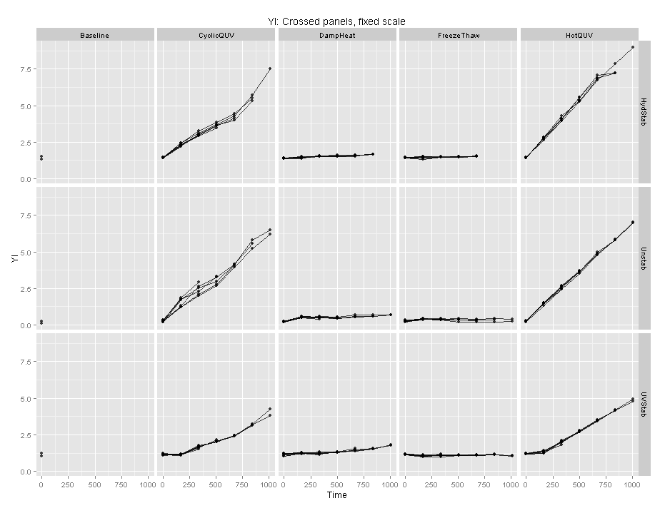

#### Exploratory Data Analysis 

  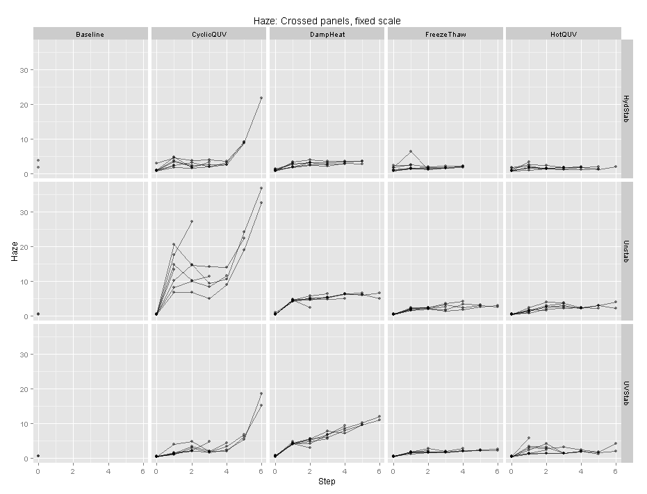

#### Comments

  Very useful to 

  - identify outliers
  - Look for trends and change points
  - compare different materials and exposures
  - Observe sample and measurement variability


#### Exploratory Data Analysis

  Absorbance at 300 nm and 400 nm for Unstabilized PET

  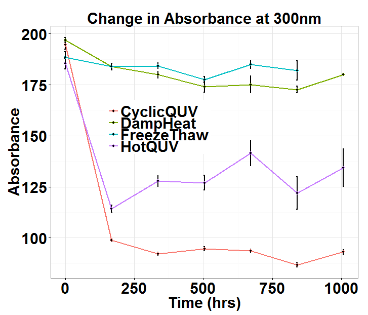
  
  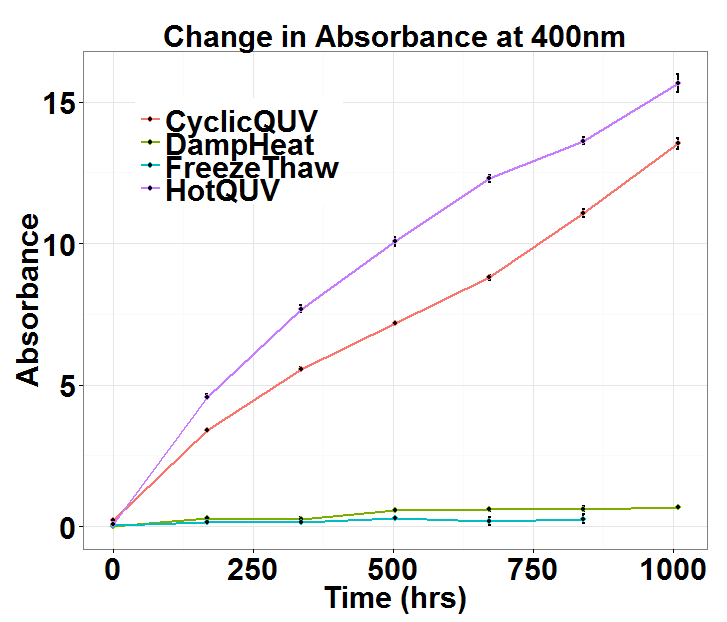

##### Exploratory Data Analysis

  IAD at 300 nm and 400 nm for Unstabilized PET

  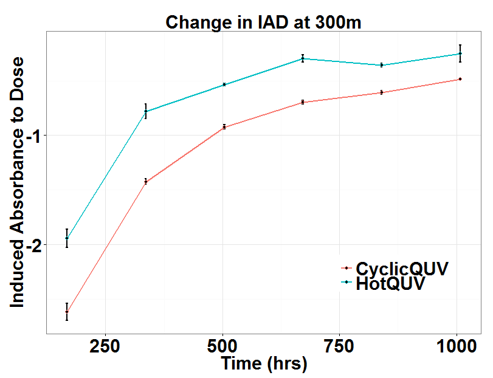
  
  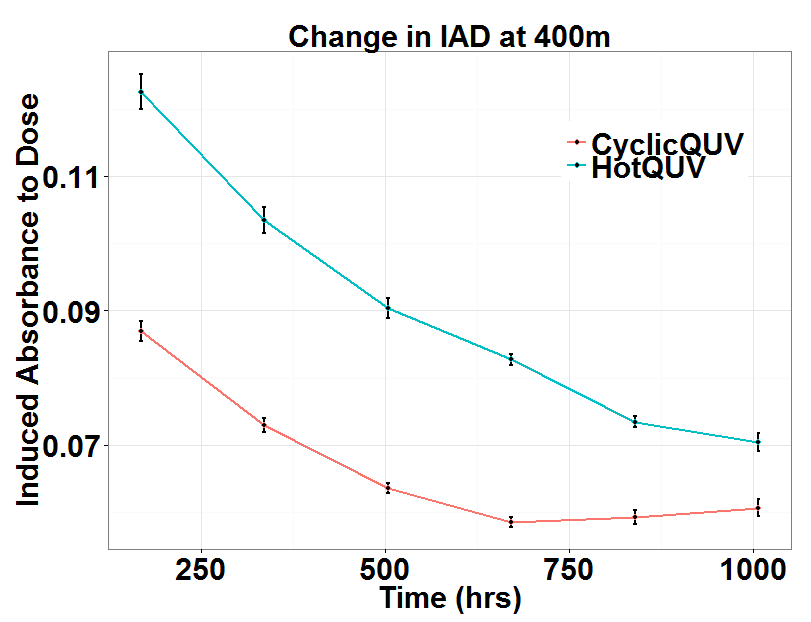

##### Exploratory Data Analysis

  Yellowness Index and Haze(\%) for Unstabilized PET

  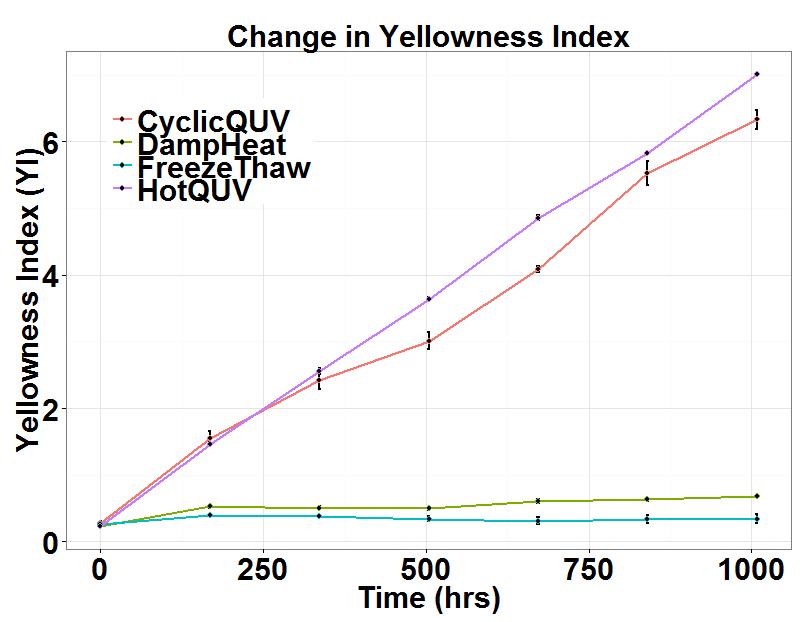

  


##### Exploratory Data Analysis

  Absorbance at 300 nm and 400 nm for UV stabilized PET

  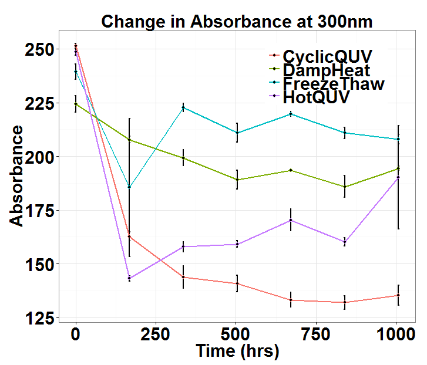
  
  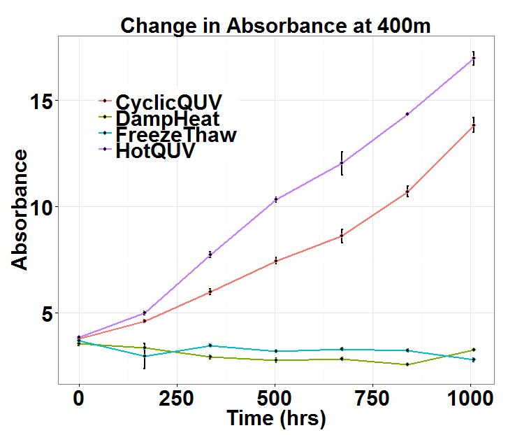


##### Exploratory Data Analysis

  IAD at 300 nm and 400 nm for UV stabilized PET

  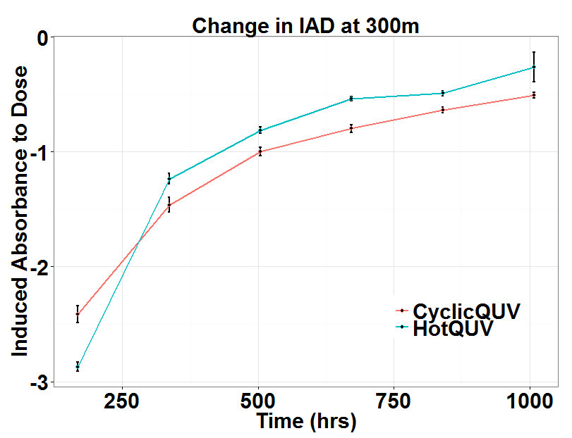
  
  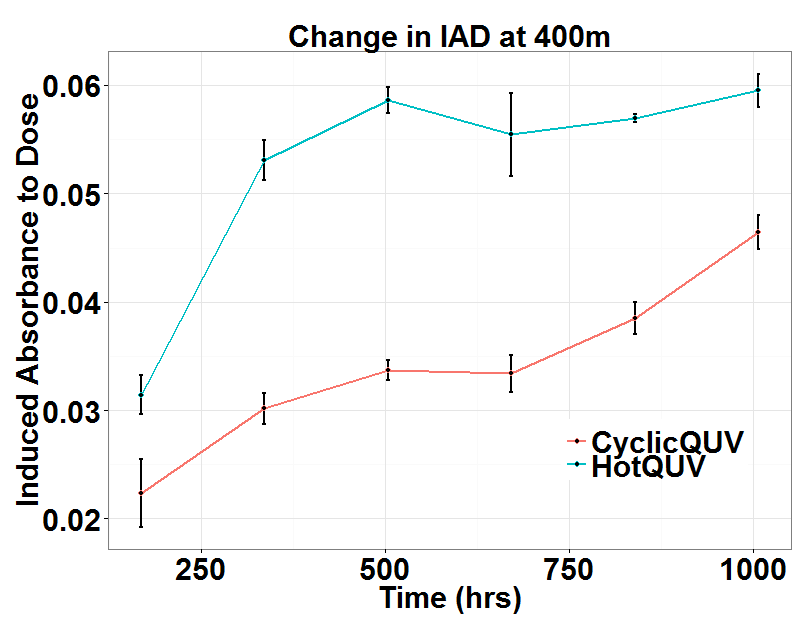

##### Exploratory Data Analysis

  Yellowness Index and Haze(\%) for UV stabilized PET

  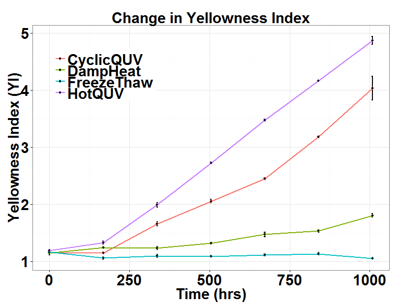

  


##### Exploratory Data Analysis

  IAD at 300 nm and 400 nm for Hyd. stabilized PET

  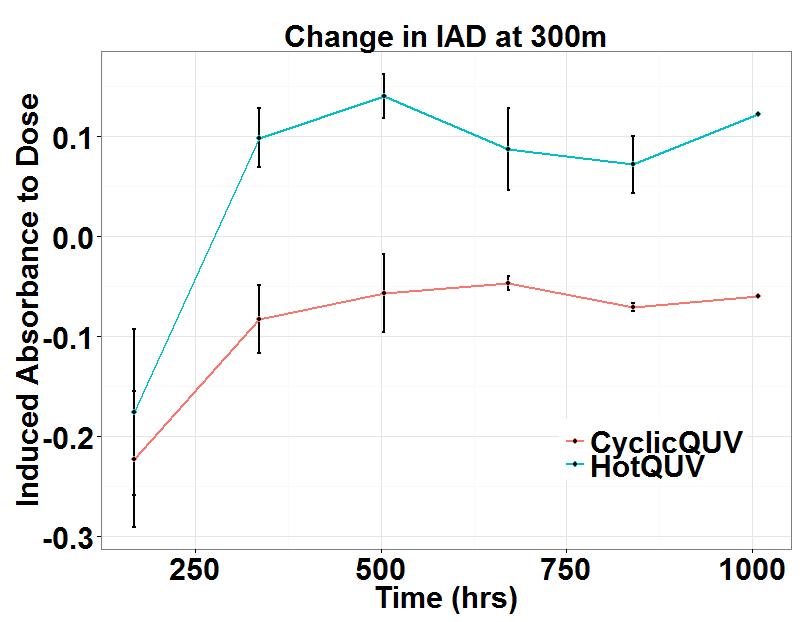

  


##### Exploratory Data Analysis

  Yellowness Index and Haze(\%) for Hyd. stabilized PET


  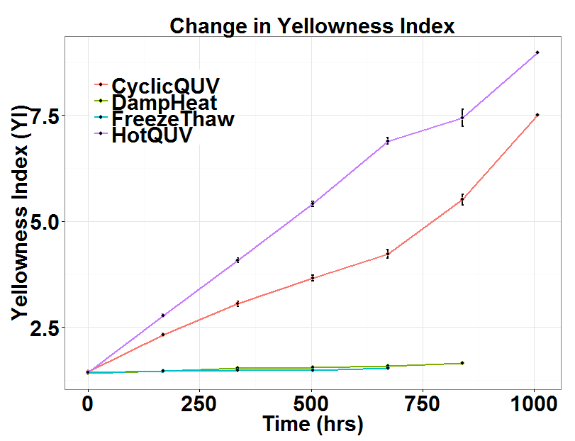

  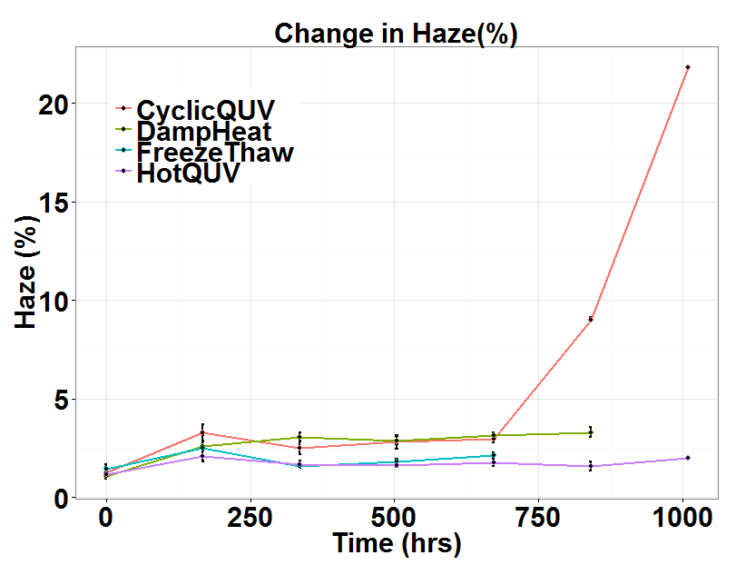


#### Comments

  - Light induced yellowing in light exposures (con't UVA and cyclic UVA)
  - Moisture induced hazing (cyclic UVA and damp Heat)
  - It's more detrimental when light and moisture are coupled
  - Freeze thaw is the less damaging
  - Change point observed in the UV stabilized PET due to stabilizer consumption in light exposures. 


#### Concluding Remarks

  - R is a powerful tool!!!


#### Update on PetDegr Materials {.smaller}

  Six candidate materials and seven exposures
  
  Exposure | Condition | Status
  -------- | --------- | ------
  Outdoor 1X | 1X conc. on dual axis trackers | Ready
  Outdoor 4X | 4X conc. on dual axis trackers |Ready
  Continuous UVA | Constant exposure of UVA light at 1.55 $W/m^{2}$ at 340nm at 70^o^C | Ready
  ASTM G154-4 | Cyclic exposure of UVA light at 1.55 $W/m^{2}$ at 340nm at 70^o^C for 8 hours and condensing humidity at 50^o^C in the dark for 4 hours | Ready
  Modified Damp Heat - IEC 61215 | Constant exposure x^o^C / 85\% RH exposure | Temperature TBD
  Modified Humidity Freeze  - IEC 61215 | Cyclic exposure of y^o^C / 85\% RH and -c^o^C / 0\%RH | Temperature TBD
  Multi-Factor | Full spec. light, heat, and humidity | Temperature and humidity TBD


##### Update on PetDegr Materials {.smaller}

Baselining is ongoing

Evaluation                  | Instrument                           | Technique                                 | Progress
--------------------------- | ------------------------------------ | ----------------------------------------- | --------
UV-Vis-NIR Optical spec.    | Cary 6000i with DRA (200-1800nm)     | Center mount absorbance                   | DOne         
UV-Vis-NIR Optical spec.    | Filmetrics PartsUV  (200-1100nm)     | Direct T% and specular R%                 | Done         
Color Measurement           | Hunterlabs UltraScanPro (350-1050nm) | CIE $L^*a^*b^*$ Color - YI and Haze       | Done         
Gloss Measurement           | BKY Gardner Micro-TRI-Gloss          | 20-60-85^o^ Gloss                         | Done          
Scattering BRDF and BSDF    | ScatterMaster                        | Transmissive and Reflective Scattering    | Done            
Fluorescence Spec.          | Cary Eclipse Fluorimeter             | Fluorescence Spectra                      | Developing method      
Nanoindentation             | Agilent Nanoindenter G200            | Elastic modulus and hardness              | Developing method       
Infrared Spec.              | Agilent Cary 630 FTIR                | Diamond ATR-IR Spectra                    | Developing method       

