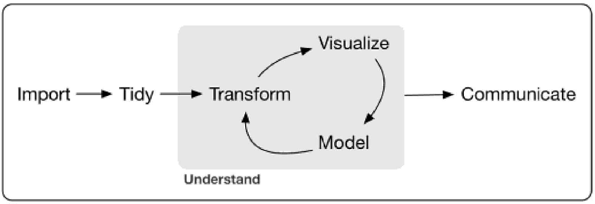

 
 \setcounter{section}{3}
 \setcounter{subsection}{1}
 \setcounter{subsubsection}{1}

<!--
# Script Name: 1708-351-451-HW2-ForLoop-NAME.Rmd
# Purpose: This is a blank Rmd file to start a new open science data analysis from
# Authors: Roger H. French
# License: Creative Commons Attribution-ShareAlike 4.0 International License.
##########
# Latest Changelog Entires:
# v0.00.01 - 1501cwru-dsci-NAMEIT.RMD - Roger French started this blank Rmd
##########

# Rmd code goes below the comment marker!
-->

#### Reading, Homeworks, Projects, SemProjects

  - Readings: 
    - Open Intro Stats, 1-1.9
  - Homeworks
    - HW2 due today
  - Data Science Projects: 
    - First Project given out 9/19, next Tuesday
    - Due Tuesday October 3rd
    - You have two weeks to do it
  - 451 SemProjects:  
    - 1st Report Out is week of Sept. 26/28, 2017
  - Friday Comm. Hour
    - 451 students: Come discuss your SemProjects

#### Syllabus

#### DSCI451: Semester long Data Science Research Project

A Data Analysis/Prediction & Modeling Project

Same as what is done in DSCI 352-352M-452

##### Purpose of Semester Project Assignment

In the Semester Project, for students enrolled in DSCI451, 

  - you will take a four-part approach 
      - to doing a data analysis through EDA and Insights 
      - for a topic from your area of research interest. 
  - If you are able to do some modeling and statistical learning, all the better.  

#### Basic steps we use to construct a data analysis.

Modified from Jeff Leek’s slides 

  - (available in your repo in class/Leek) 
  
And following Hadley Wickham's Tidyverse and R for Data Science approach

  

###### SemProj. Part a) Define Question

  - Background on the research area and critical issues
  - Define the question
  - Define the ideal data set
  - Determine what data you can access
  - Define critical capabilities and identify packages you will draw upon
  - Obtain the data, define you target data structure
  - Clean and tidy the data

###### SemProj Part b) Cleaning and EDA

  - Write you databook, defining variables, units and structures
  - Data visualization and exploratory data analysis
  - Observations of trends and functional forms
  - Power transformations
  - Validate with reference to domain knowledge
  - Evaluate the types of Modeling Approaches to take

###### SemProj Part c) Modeling and Statistical Learning

  - Types of modeling to try
  - Statistical prediction/modeling
  - Model selection
  - Cross-validation, Predictive R2
  - Interpret results
  - Challenge results

###### SemProj Part d) Present your final models and learnings

  - Present your results
  - Present reproducible code
  - Comparison to other modeling approaches in the literature

#### 3 SemProj Report Outs and 1 Final Report

You will use .R scripts and 

  - do reports and presentations in .Rmd files, 
  - so that they are interactive, reproducible, open-science presentations.

Organize and store you code in your repo.

You will turn in all code (.R and .Rmd) and datasets as part of the project.

In Friday Community Hour we will have a SemProj discussion, 

  - to discuss your progress, experiences and questions.

#### SemProj. Report Outs

Your first SemProj. Rmd report and presentation will be 

  - the Week 5, September 25 and 27, 2017.

We will distribute the report out dates.

By now you've learned some R and Rmd, 

  - and now are either 
    - defining your Semester Project topic
    - or been give access to your ODS DataPackage repo for your semester project.
    
So using the outlined structure in the syllabus, 

  - prepare a Rmarkdown document, with Rcode blocks, 
  - and demonstrate what types of things you have learned so far, 
  - and what you are thinking to pursue in your project. 
  
##### In a data analysis this phase is 

  - defining good questions, 
  - defining the required data, and 
  - seeing if you have access to it.  
  - And what questions you might need to explore in this data.
  
You've also learned some R, 

  - from Peng's EDA with R materails, 
  - so you can demonstrate some of these elements also.
  
##### Presentation will be a total of 10 minutes

  - 8 minutes
  - with 2 minutes for questions from you mentor and classmates.
  - Classmates must ask at least 2 questions.

##### It would be typical to present information on

  - Background of the data and application
  - Variables you will need to have in your dataset
  - Units of these variables, and types (metadata, categorical, numerical)
  - Assembly of your dataframe
  - What would be the column variables in your dataframe
  - What are the rows in your dataframe (the multiple simultaneous observations)
  - What data cleaning and data validation do you need to consider doing
  - What would be initial exploratory data analysis you should do
  
#### SemProj Report Out 2 and 3

Your second SemProj. Rmd report and presentation will be 

  - the Week 9b, October 25th, 2018.
  
Your third SemProj. Rmd report and presentation will be 

  - the Week 15, December 4th, and 6th, 2018.
  
#### The final  SemProj. Rmd report  will be 

  - the day of the final exam
  - December 17th, 2017, by midnight.  
  

#### Final Semester Project Report Structure and Format

For DSCI451, the final data science research report should be written like a scientific paper 

##### Final Report Out has the following types of sections.

  - Title
  - Author
  - Author Affilication
  - License: ideally CC-BY-SA 4.0 (but a license choice is yours)
  - Abstract
  - IntroductionModeling
  - Data Science Methods
  - Exploratory Data Analysis
  - Statistical Learning: Modeling & Prediction(if appropriate)
  - Discussion
  - Conclusions
  - Acknowledgements
  - References, Citations

##### Abstract

Summary of the nature, finding and meaning of your data analysis project.

##### Introduction

Background and motivation of the Data Science question

##### Data Science Methods

To be applied (such as image processing, time-series analysis, spectral analysis etc

#####  Exploratory Data Analysis

Results and steps in the data analysis

##### Statistical Learning: Modeling & Prediction

If your analysis can accomplish some modeling, include it here.

##### Discussion

Discussion of the answers to the data science questions framed in the introduction

#####  Conclusions

##### Acknowledgements

##### References

####  How to make your report

The report is done as an Rmarkdown document, 

  - which can be run/compiled to produce two versions of the report as a pdf. 

One shows your R code and figures, and 

  - the other doesn’t show R code, just your figures.

You’ll then turn in a zip file (and leave a copy in your repo), 

  - with the dataset 
    - (if its not to huge, if it is large, can you make a smaller dataset), 
  - Rmd file that works, 
  - and the two pdf reports.

Just do a pdf report as the final report, 

  - instead of a set of presentation slides.

The license choice of CC-BY-SA 4.0 is suggested 

  - so that others can use and build on your codes, in an open-source manner. 

With more restrictive licenses, 

  - others won’t be able to use your code in the future.

