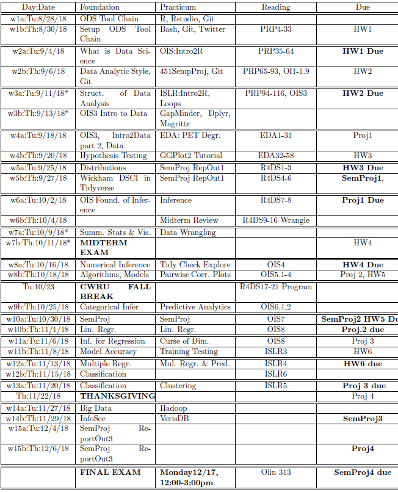

```{r setup, include=FALSE}
knitr::opts_chunk$set(echo = TRUE)
```

 \setcounter{section}{5}
 \setcounter{subsection}{2}
 \setcounter{subsubsection}{1}
 
 <!-- 
 How to make comments inside Rmarkdown
# Script Name: My class notes template for Fall 2016
# Purpose: This is a template Rmd file to start a new class from
# Authors: Roger H. French
# License: Creative Commons Attribution-ShareAlike 4.0 International License.
##########
# Latest Changelog Entires:
# v0.00.01 - Filename.Rmd - Roger French started this blank Rmd script
-->

<!-- Or on a single line like this -->
 

#### Reading, Homeworks, Projects, SemProjects

  * Readings: 
    * R4DS 4-6 for today
    * R4DS 7-8 for Tuesday
  * Homeworks
    * 
  * Data Science Projects: 
    * Proj1 Due Next Tuesday before class
  * 451 SemProjects:  
    * 4 Report Outs today
  * Friday Comm. Hour
    * Discuss Data Sci, Proj1, SemProj, etc.

#### Textbooks

  - [Peng: R Programming for Data Science](https://play.google.com/books/reader?printsec=frontcover&output=reader&id=F1mVHgAAAEAJ&pg=GBS.PA1)
  - [Peng: Exploratory Data Analysis with R](https://play.google.com/books/reader?printsec=frontcover&output=reader&id=R-09BgAAAEAJ&pg=GBS.PA1)
  - [Open Intro Stats, v3](https://play.google.com/books/reader?printsec=frontcover&output=reader&id=G2EOBwAAAEAJ&pg=GBS.PA0)
  - [Wickham: R for Data Science](https://play.google.com/books/reader?printsec=frontcover&output=reader&id=I6y3DQAAQBAJ&pg=GBS.PA1)
  - [Hastie: Intro to Statistical Learning with R](https://play.google.com/books/reader?printsec=frontcover&output=reader&id=KtuPCwAAAEAJ&pg=GBS.PA0)
  
#### Syllabus



#### Tidyverse thinking

##### Hadley Wickham Talk on Tidyverse

Watch this one for class

  - [Hadley Wickham on Tidyverse](https://youtu.be/K-ss_ag2k9E)

Alternatively here is a more extended version

  - [RConf-Jan 2017: Data Science in the Tidyverse](https://www.rstudio.com/resources/videos/data-science-in-the-tidyverse/)
  And slides 
  
##### Hadley has a great book on making R packages

Its available to read online

  - [R Packages](http://r-pkgs.had.co.nz/)

##### Purrr is another part of the Tidyverse

purrr enhances R's functional programming (FP) toolkit 

  - by providing a complete and consistent set of tools 
  - for working with functions and vectors. 
  
If you've never heard of FP before, 

  - Check Wikipedia first
    - [Functional Programming](https://en.wikipedia.org/wiki/Functional_programming)
  - the best place to start is 
  - the family of map() functions 
    - which allow you to replace many for loops 
    - with code that is both more succinct and easier to read. 

The best place to learn about the map() functions 

  - is the iteration chapter in R for data science.

  - [Use quick formula functions in purrr::map (+ base vs tidtyverse idiom comparisons/examples)](https://rud.is/b/2016/07/26/use-quick-formula-functions-in-purrrmap-base-vs-tidtyverse-idiom-comparisonsexamples/)

  [purrr tutorial](https://jennybc.github.io/purrr-tutorial/)

#### An Exmaple

  [Chart: It’s not your imagination, US gun violence is over the top this summer](https://qz.com/741391/its-not-your-imagination-gun-violence-is-over-the-top-this-summer/)

  [Falling into the Pit of Success](https://blog.codinghorror.com/falling-into-the-pit-of-success/)

##### Jenny Bryan on Data Wrangling

  [Jenny Bryan on Data Wrangling](https://youtu.be/4MfUCX_KpdE)

  [Basic care and feeding of data in R](http://stat546.com/block006_care-feeding-data.html)


