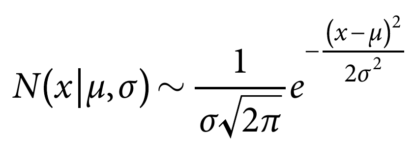
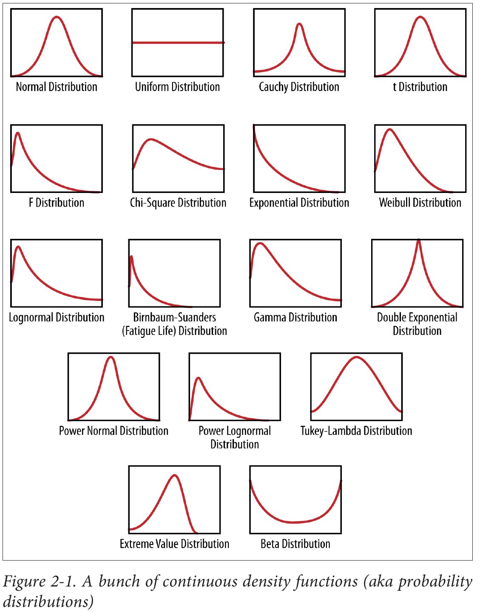
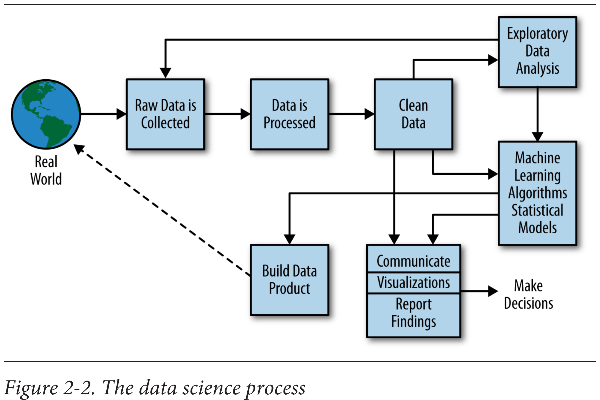
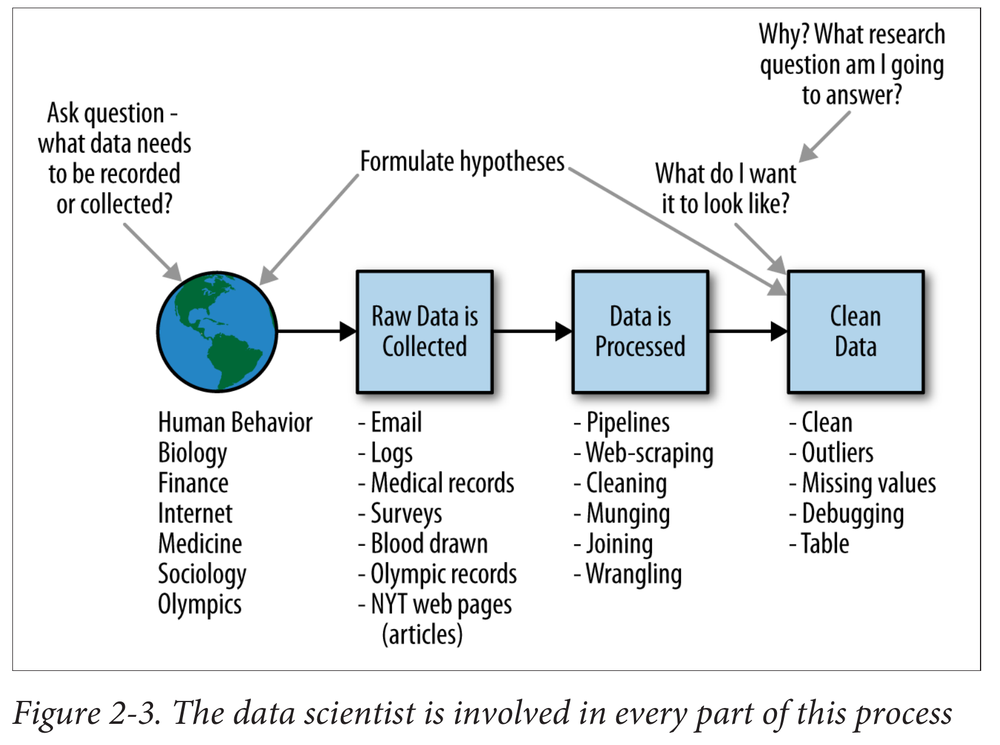

 \setcounter{section}{6}
 \setcounter{subsection}{1}
 \setcounter{subsubsection}{0}
 
 <!-- 
 How to make comments inside Rmarkdown
# Script Name: My class notes template for Fall 2016
# Purpose: This is a template Rmd file to start a new class from
# Authors: Roger H. French
# License: Creative Commons Attribution-ShareAlike 4.0 International License.
##########
# Latest Changelog Entires:
# v0.00.01 - Filename.Rmd - Roger French started this blank Rmd script
-->

#### Reading, Homeworks, Projects, SemProjects

  - MidTerm Exam next Thursday October 11th
    - MidTerm Review in today
  * Readings: 
    * R4DS 9-16 Data Wrangling for today
  * Homeworks
    * HW4 given out next Thursday Oct. 11th
    * Due following Tuesday October 16th
    * HW5 comes Thursday 10/18
  * Data Science Projects: 
    * Project 2 comes on Thursday 10/18
  * 451 SemProjects:  
    * 
  * Friday Comm. Hour
    * 

#### Textbooks

  - [Peng: R Programming for Data Science](https://play.google.com/books/reader?printsec=frontcover&output=reader&id=F1mVHgAAAEAJ&pg=GBS.PA1)
  - [Peng: Exploratory Data Analysis with R](https://play.google.com/books/reader?printsec=frontcover&output=reader&id=R-09BgAAAEAJ&pg=GBS.PA1)
  - [Open Intro Stats, v3](https://play.google.com/books/reader?printsec=frontcover&output=reader&id=G2EOBwAAAEAJ&pg=GBS.PA0)
  - [Wickham: R for Data Science](https://play.google.com/books/reader?printsec=frontcover&output=reader&id=I6y3DQAAQBAJ&pg=GBS.PA1)
  - [Hastie: Intro to Statistical Learning with R](https://play.google.com/books/reader?printsec=frontcover&output=reader&id=KtuPCwAAAEAJ&pg=GBS.PA0)
  
#### Syllabus

#### Statistical Inference, Exploratory Data Analysis, and the Data Science Process

##### Doing Data Science

  - What to be thinking about as we do DSCI
  
##### Statistical Thinking in the Age of Big Data

[The Age of Big Data, Steve Lohr, The New York Times](http://www.nytimes.com/2012/02/12/sunday-review/big-datas-impact-in-the-world.html?mcubz=1)

Big Data is a vague term, used loosely, if often, these days. 
But put simply, the catchall phrase means three things. 

  - First, it is a bundle of technologies. 
  - Second, it is a potential revolution in measurement.
  - And third, it is a point of view, or philosophy, 
    + about how decisions will be—and perhaps should be—made in the future.

Data Science is a practical mixture of Statistics, Coding, Linear Algebra, 

  - And Domain Knowledge
  
#### Frequentist vs. Bayesian Statistics

##### Frequentist Statistics has to do with

  - Inferring the properties of the population
  - From a sample taken from the population
  - And it is based in 
    - probability densities
    - and observed statistical frequency in a sample
  - It is the most common type of inferential statistics
    
##### Bayesian Statistics focuses on

  - Current observed results
    - referred to as priors
  - And trys to infer what future observed results will be
    - Using the information already acquired from Priors
  - It doesn't use the "Take a Sample from a Population" approach
  - Popular for problems that are difficult using Frequentist Statistics
  
#### Lets get founded in statistical inference
  
  - different from descriptive statistics
  - which is basically reductive
    - Calculating the mean and standard deviation
      - reduces the number of values in your dataset
      - and destroys information!
  
##### Statistical Inference

  - The world we live in is complex, random, and uncertain. 
  - At the same time, it’s one big data-generating machine.
  - Data represents the traces of the real-world processes, 
  - and exactly which traces we gather are decided by our data collection or sampling
method. 
  - You, the data scientist, the observer, 
    + are turning the world into data, 
    + and this is an utterly subjective, not objective, process.

There are two sources of randomness and uncertainty. 

  - the randomness and uncertainty underlying the process itself, 
  - and the uncertainty associated with your underlying data collection methods.
  
Once you have all this data, you have somehow captured the world, or certain traces of the world.

So you need a new idea, and that’s to simplify those captured traces into something more comprehensible, 

  - to something that somehow captures it all in a much more concise way, 
  - and that something could be mathematical models or functions of the data, 
  
These are known as statistical estimators. 

This overall process of going 

  - from the world to the data, 
  - and then from the data back to the world, 
  
Is the field of statistical inference.

#### Populations and Samples

In classical statistical literature, a distinction is made between the population and the sample. 

##### Population

  - The word population immediately makes of people
  - But it can  be any set of objects or units, 
    + such as tweets or photographs or stars.
    
If we could measure the characteristics of all those objects, 

  - we’d have a complete set of observations, 
  - and the convention is to use N to represent 
    + the total number of observations in the population.

##### Sample

When we take a sample, 
  
  - we take a subset of the units of size n 
  - in order to examine the observations to draw conclusions 
  - and make inferences about the population.

#### Populations and Samples of Big Data

But, wait! 

  - In the age of Big Data, 
    + where we can record all users’ actions all the time, 
    + don’t we observe everything? 
  - Is there really still this notion of population and sample? 
  - If we had all the email in the first place,
    + why would we need to take a sample?

Sampling solves some engineering challenges

  -  the focus on Hadoop to handle engineering and computational challenges 
    + caused by too much data 
  - Overlooks sampling as a legitimate solution. 
    + At Google, for example, software engineers, data scientists, and statisticians 
    + sample all the time.

##### Bias

  -  any inferences we make from that data should not be extended 
  - to draw conclusions about humans beyond those sets of users, 
  - or even those users for any particular day.
    + Example of tweets and hurricane Sandy

##### Sampling

  - Let’s rethink what the population and the sample are in various contexts.

In statistics we often model the relationship between 

  - a population and a sample 
  - with an underlying mathematical process. 

So we make simplifying assumptions about 

  -  the underlying truth, 
  - the mathematical structure, and shape 
    - of the underlying generative process that created the data. 
    
We observe only one particular realization 

  - of that generative process, 
  - which is that sample.

Sampling is beneficial to our thiking

  - Since a sample of a population
  - Will change with the next sampling we do
  - So we intrinsically have the uncertainty
  - And variability of sampling, too keep us honest!

#### Big Data Can Mean Big Assumptions

“Big” is a moving target. 

  - Big Data isn't a size.
    + ie 1 petabyte is big?
    + it can be, but maybe not
    + depends on the data

“Big” is when you can’t fit it on one machine. 
  
  - Not a useful distinction
  - I've been doing things since Cray1
  - A good computer now is like the Cray1 
  - In our research group we use >200 computers 
  - Scaleable analytics is critical
  - And number of computers is irrelevant
    + Except if you only demo things on your mac
    + Thats not big data, that phone data
    
Big Data is a cultural phenomenon.

  - It describes how much data is part of our lives, precipitated by accelerated advances in technology.
    + this has some validity
    
The 4 Vs:

  - this seems to work
    + Volume, variety, velocity, and value.

##### N = All?

  - Collecting and using a lot of data rather than small samples  
  - Accepting messiness in your data
  -  Giving up on knowing the causes
    + Not so good
  
Data is not objective

  - Another way in which the assumption that N=ALL can matter 
  - is that it often gets translated into the idea that data is objective. 
   -It is wrong to believe either that data is objective or that “data speaks,” 
    -and beware f people who say otherwise.

##### N = 1

the other end of the spectrum from N=ALL, we have n = 1, 

  - by which e mean a sample size of 1. 
  - In the old days a sample size of 1 would be ridiculous; 
  - you would never want to draw inferences about an entire population by looking at a single individual. 
  
But the concept of n = 1 takes on new meaning in the age of Big Data, 

  - where for a single person, we actually can record tons of information about them, 
  - and in fact we might even sample from all the events or actions they took 
    + (for example, phone calls or keystrokes) 
  - in order to make inferences about them. 
  - This is what user-level modeling is about.

#### Modeling

  - Data "models" are schema on how to store data for computer scientisits
  - Data Scientists want statistical models or mathematical models
  
Who is following Andrew Gelman on twitter?

  - Who knows who Andrew Gelman is?
  - Who knows where he is?
  - [http://andrewgelman.com/](http://andrewgelman.com)
  - Good discussion of current Statistical Topics
    - [http://andrewgelman.com/2017/09/26/abandon-statistical-significance/](http://andrewgelman.com/2017/09/26/abandon-statistical-significance/)

##### What is a Model

  - A model is our attempt to understand and represent 
    - the nature of reality through a particular lens, 
    - be it architectural, biological, or mathematical.
  - A model is an artificial construction 
    - where all extraneous detail has been removed or abstracted. 
    - Attention must always be paid to these abstracted details 
    - after a model has been analyzed 
      - to see what might have been overlooked.

##### Statistical Models and Greek and Latin Letters (Important)

[Notation in Statistics](https://en.wikipedia.org/wiki/Notation_in_probability_and_statistics#Statistics)

In mathematical expressions, the convention is 

  - to use Greek letters for parameters 
  - and Latin letters for data. 
  
So, for example, if you have two columns of data, x and y, 

  - and you think there’s a linear relationship,
  - you'd write down $y=\beta_0 + \beta_1x + \epsilon$.
    - Where $\epsilon$ is a random error term
    - In this way, the equation represents the actual data points
    - Not the fitted line (which only approximately fits the data)

You don’t know what $\beta_0$ and $\beta_1$ are in terms of actual numbers yet, 

  - so they’re the parameters.

We do this notation in an .Rmd file

  - Using LaTeX Math Mode for the symbols
  - Using inline math mode 
    -   $\beta_0$ and $\beta_1$ 
  -  Or using normal math mode
  
  $$y=\beta_0 + \beta_1x + \beta_2x^2 + \beta_3x^3 + \epsilon$$

##### How do you build a model

  - One place to start is exploratory data analysis (EDA)
  - This entails making plots and building intuition for your particular dataset. 
  - EDA helps out a lot, 
  - Another approach to modeling is trial and error and iteration.

##### Remember, it’s always good to start simply. 
  
  - There is a trade-off in modeling between simple and accurate. 
    + Simple models may be easier to interpret and understand. 
    + Oftentimes the crude, simple model gets you 90% of the way there
    + and only takes a few hours to build and fit,
  - whereas getting a more complex model 
    + might take months and only get you to 92%.

#### Probability Distributions

Probability distributions are the foundation of statistical models.

Back in the day, before computers, 

  - scientists observed real-world phenomena, took measurements, 
  - and noticed that certain mathematical shapes kept reappearing. 
  
The classical example is the height of humans, 

  - following a normal distribution—a bell-shaped curve, 
  - also called a Gaussian distribution, named after Gauss.

Other common shapes have been named after their observers as well

  - (e.g., the Poisson distribution and the Weibull distribution), 
  - while other shapes such as Gamma distributions or exponential distributions 
  - are named after associated mathematical objects.
  
Natural processes tend to generate measurements 

  - whose empirical shape could be approximated 
  - by mathematical functions with a few parameters 
  - that could be estimated from the data.

Figure 2-1 as an illustration of the various common shapes, 

  - Remember they only have names 
  - because someone observed them enough times to think they deserved names. 
  - There is actually an infinite number of possible distributions.

They are to be interpreted as assigning a probability 

  - to a subset of possible outcomes, 
  - and have corresponding functions. 
  
For example, the normal distribution is written as:

{ width=40% }

The parameter $\mu$ is the mean and median 

  - and controls where the distribution is centered 
  - (because this is a symmetric distribution), 

and the parameter $\sigma$ controls 

  - how spread out the distribution is. 
  
Note the Greek letter parameters (estimators)
  
  - and the Latin letters for data (variables)
  
This is the general functional form, 

  - but for specific real-world phenomenon,
  - these parameters have actual numbers as values, 
  - which we can estimate from the data.

#### A bunch of distributions for different uses

{ width=70% }

##### Distribution of a single random variable $p(x)$ 

A random variable denoted by x or y can be assumed to have 

  - a coresponding probability distribution, $p(x)$ , 
  - which maps x to a positive real number. 
  
In order to be a probability density function, 

  - we’re restricted to the set of functions 
  - such that if we integrate p (x) to get the area under the curve, 
  - it is 1, so it can be interpreted as probability.

##### Joint distributions $p(x,y)$

In addition to denoting distributions of single random variables 

  - with functions of one variable, 
  
we use multivariate functions called joint distributions 

  - to do the same thing for more than one random variable.
  
So in the case of two random variables, for example, 

  - we could denote our distribution by a function p (x,y), 
  - and it would take values in the plane 
  - and give us nonnegative values. 
  
In keeping with its interpretation as a probability, 

  - its (double) integral over the whole plane would be 1.

##### Conditional Distributions $p(x|y)$

a conditional distribution, $p(x|y)$ 
 
  - which is to be interpreted as 
  - the density function of $x$ 
  - given a particular value of $y$.
  
When we’re working with data, 

  - conditioning corresponds to subsetting.
  - i.e. applying a condition to the dataset

Example 

  - suppose we have a set of user-level data for Amazon.com 
  - that lists for each user 
    + the amount of money spent last month on Amazon, 
    + whether the user is male or female, 
    + and how many items they looked at before adding the first item to the shopping cart.

If we consider x to be the random variable that represents the amount of money spent, 

  - then we can look at the distribution of money spent across all users, 
  - and represent it as $p(x)$.

We can then take the subset of users 

  - who looked at more than five items before buying anything, 
  - and look at the distribution of money pent among these users. 
  
Let y be the random variable that represents number of items looked at, 

  - then $p(x|y) > 5$ would be the corresponding conditional distribution. 
  
Note a conditional distribution has the same properties 

- as a regular distribution in that 
- when we integrate it, it sums to 1 and has to take nonnegative values.

#### Fitting a model

Fitting a model means that 

  - you estimate the parameters of the model
  - using the observed data. 
  
You are using your data as evidence to help approximate the real-world 
mathematical process that generated the data. 

Fitting the model often involves optimization methods and algorithms, 

  - such as maximum likelihood estimation, 
  - to help get the parameters.
  
  
In fact, when you estimate the parameters, 

  - they are actually estimators, 
  - meaning they themselves are functions of the data. 
  
Once you fit the model, you actually can write it as y = 7.2 + 4.5x, for example,
which means that your best guess is that this equation or functional
form expresses the relationship between your two variables, based on
your assumption that the data followed a linear pattern.

Beware of overfitting

  - The Bias-Variance Tradeoff
  - https://en.wikipedia.org/wiki/Bias%E2%80%93variance_tradeoff 
    - More discussed in DSCI353-453
    - And in Introduction to Statistical Learning with R (ISLR book)

#### Exploratory Data Analysis

“Exploratory data analysis” is an attitude, a state of flexibility, 
a willingness to look for those things that we believe are not there, 
as well as those we believe to be there.

— John Tukey

John Tukey, a mathematician at Bell Labs, 
  - developed exploratory data analysis in contrast to confirmatory data analysis, 
  - which concerns itself with modeling and hypotheses.
  
In EDA, there is no hypothesis and there is no model. 
  - The “exploratory” aspect means that 
  - your understanding of the problem you are solving, or might solve, 
  - is changing as you go.

The basic tools of EDA are plots, graphs and summary statistics. 

Generally speaking, it’s a method of systematically going through the data,

  - plotting distributions of all variables (using box plots), 
  - plotting time series of data, 
  - transforming variables, 
  - looking at all pairwise relationships between variables 
    + using scatterplot matrices, 
  - and generating summary statistics for all of them. 
  
At the very least that would mean
  
  - computing their mean, 
  - minimum, 
  - maximum, 
  - the upper and lower quartiles, 
  - and identifying outliers.

##### Philosophy of Exploratory Data Analysis

Long before worrying about how to convince others, you first have
to understand what’s happening yourself.

— Andrew Gelman

#### The Data Science Process

Let’s put it all together into what we define as the data science process.

{ width=70% }

First we have the Real World. 

Inside the Real World are lots of people busy at various activities. 

We start with raw data

We want to process this to make it clean for analysis. 
So we build and use pipelines of data munging: joining, scraping, wrangling, or whatever you want to call it. 
To do this we use tools such as Python, shell scripts, R, or SQL, or all of the above.

Once we have this clean dataset, 

  - we should be doing some kind of EDA.
  
In the course of doing EDA, we may realize 

  - that it isn’t actually clean because of 
    + duplicates, missing values, absurd outliers, 
    + and data that wasn’t actually logged or incorrectly logged. 

If that’s the case, we may have to go back 

  - to collect more data, 
  - or spend more time cleaning the dataset.

Next, we design our model to use some algorithm

  - like k-nearest neighbor (k-NN), linear regression, Naive Bayes, or something else.

The model we choose depends on the type of problem we’re trying to solve, 

  - The type of data science problem/question could be 
  - a classification problem, 
  - a prediction problem, 
  - or a basic description problem.

#### A Data Scientist’s Role in This Process

{ width=70% }

