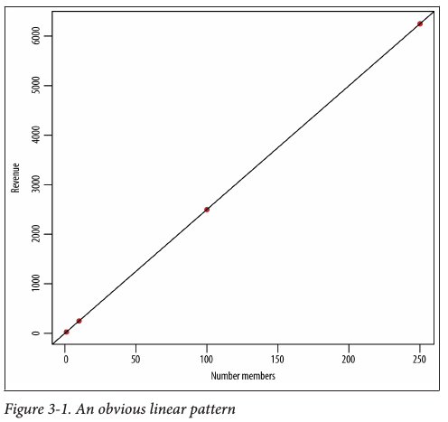

<!-- ioslides themese: "cerulean", "journal", "flatly", "readable", "spacelab", "united", "cosmo" -->

 \setcounter{section}{8}
 \setcounter{subsection}{2}
 \setcounter{subsubsection}{1}

```{r setup, include=FALSE}
knitr::opts_chunk$set(echo = TRUE)
knitr::opts_chunk$set(fig.width=6, fig.height=4.5) 
```

#### Projects

  - [Why you should start by learning data visualization and manipulation](http://www.sharpsightlabs.com/start-with-data-visualization-manipulation/)
  - [Exploratory Data Analysis and Graphics](http://www.astrobiased.com/2015/01/20/eda-and-graphics/)
  - [Going deeper with dplyr: New features in 0.3 and 0.4 \(video tutorial\)](http://www.r-bloggers.com/going-deeper-with-dplyr-new-features-in-0-3-and-0-4-video-tutorial/)
  

#### Twitter Data mining for EDA

  * [deprecated twitter datamining](https://sites.google.com/site/miningtwitter/)
  * [How to reveal anyone’s interests on Twitter using social network analysis](http://www.r-bloggers.com/how-to-reveal-anyones-interests-on-twitter-using-social-network-analysis/)
  * [Twitter Network Analysis](http://www.eanalytica.com/blog/twitter-network-analysis-in-R/)
  * [Graph Analysis of Twitter and people's interests](http://cartesianfaith.com/2014/09/22/how-to-reveal-anyones-interests-on-twitter-using-social-network-analysis/)
  * [Social Network Analysis](https://rdatamining.wordpress.com/2012/03/27/social-network-analysis-with-r/)
  
#### Word clouds for visualization

  * [Shiny word clouds](http://shiny.rstudio.com/gallery/word-cloud.html)
  * [Word clouds in R](http://onertipaday.blogspot.com/2011/07/word-cloud-in-r.html)
  
#### Grammar of Data Science: Comparison of R and Python for DSCI

  * [http://technology.stitchfix.com/blog/2015/03/17/grammar-of-data-science/](http://technology.stitchfix.com/blog/2015/03/17/grammar-of-data-science/)
  * 1808GrammarOfDSCI.R 
    - in your repo scripts folder

#### Doing Data Science 

  - Data Science is a melding of fields
  - And has some tension among pre-existing scientific community cultures
    + e.g. Statisitics and Computer Science
  - Stats traditionally focuses on Models and Uncertainty
  - Computer Science focuses on Algorithms and "Data Products"

#### Algorithms 

An algorithm is a procedure or set of steps or rules to accomplish a task. 

Algorithms are one of the fundamental concepts in, or building blocks of, computer science: 

  - the basis of the design of elegant and efficient code, 
  - data preparation and processing, 
  - and software engineering.

Efficient algorithms that work sequentially or in parallel 

  - are the basis of pipelines to process and prepare data.

With respect to data science,there are at least three classes of algorithms one should be aware of:

1. Data munging, preparation, and processing algorithms, 
  
  - such as sorting, MapReduce, or Pregel.

2. Optimization algorithms for parameter estimation, including 
  
  - Stochastic Gradient Descent, 
  - Newton’s Method, and 
  - Least Squares. 
  - We mention these types of algorithms throughout, 
    - and they underlie many R functions.

3. Machine learning algorithms are a big topic 
  
  - and we discuss these more next.
  - and in DSCI 353-353M-453
  - They are covered in ISLR textbook

##### Machine Learning Algorithms

  * Machine learning algorithms are largely used 
    - to predict, classify, or cluster.

So modeling could be used to predict or classify? Yes. 

  - Here’s where some lines have been drawn that can make things a bit confusing, 
  - and it’s worth understanding who drew those lines.

Statistical modeling came out of statistics departments, 

  - and machine learning algorithms came out of computer science departments. 
  - Certain methods and techniques are considered to be part of both, 
    - and you’ll see that we often use the words somewhat interchangeably.

You’ll find some of the methods, such as linear regression, 

  - in machine learning books as well as intro to statistics books. 
  - It’s not necessarily useful to argue over 
    - who the rightful owner is of these methods, 
  - but it’s worth pointing out here that it can get 
    - a little vague or ambiguous about what the actual difference is.

In general, machine learning algorithms 

  - that are the basis of artificial intelligence (AI) 
    - such as image recognition, 
    -  speech recognition, 
    -  recommendation systems, 
    - ranking and personalization of content
      - often the basis of data products
    - are not usually part of a core statistics curriculum or department. 

They aren’t generally designed to infer the underlying generative process 

  - (e.g., to model something), 
  - but rather to predict or classify with the most accuracy. 

#### Statistician and Computer Science Approaches

We say the following lovingly and with respect: 

  * Statisticians have chosen to spend their lives investigating uncertainty, 
    * and they’re never 100% confident about anything. 
  
  * Software engineers like to build things. 
  * They want to build models that predict the best they can, 
    - but there are no concerns about uncertainty—just build it! 

##### Interpreting Parameters (such as Estimators, Predictors)

  * Statisticians think of the parameters 
    - in their linear regression models 
    - as having real-world interpretations, 

And typically want to be able to find meaning 

  - in behavior or 
  - describe the real-world phenomenon corresponding to those parameters. 

Whereas a software engineer or computer scientist 

  - might be wanting to build their linear regression algorithm 
    - into production-level code, 
  - and the predictive model is what is known as a black box algorithm,

They don’t generally focus on the interpretation of the parameters. 

  - If they do, it is with the goal of handtuning them 
  - in order to optimize predictive power.

##### Confidence Intervals 

  * Statisticians provide confidence intervals and posterior distributions 
    - for parameters and estimators, 

And are interested in capturing the variability or uncertainty of the parameters. 

  * Many machine learning algorithms, 
    - such as k-means or k-nearest neighbors, 
    - don’t have a notion of confidence intervals or uncertainty.

##### The Role of Explicit Assumptions 

  * Statistical models make explicit assumptions 
    - about data-generating processes and distributions, 
    - and you use the data to estimate parameters. 

Nonparametric solutions, 
  
  - don’t make any assumptions about probability distributions, 
  - or they are implicit.

##### So Is It An Algorithm Or A Model?

While we tried to make a distinction between the two earlier, 

  - we admit the colloquial use of the words “model” and “algorithm” 
    - gets confusing because the two words seem to be used interchangeably 
  - when their actual definitions are not the same thing at all. 

In the purest sense, 

  - an algorithm is a set of rules or steps to follow 
    - to accomplish some task.
  - And a model is an attempt to describe or capture the world. 

These two seem obviously different, 

  - so it seems the distinction should should be obvious. 

Unfortunately, it isn’t. For example, 

  - regression can be described as a statistical model 
    - as well as a machine learning algorithm. 
  - You’ll waste your time trying to get people to discuss this with any precision.


In some ways this is a historical artifact 

  - of statistics and computer science communities 
  - developing methods and techniques in parallel 
    - and using different words for the same methods. 

The consequence of this is that the distinction 

  - between machine learning and statistical modeling is muddy. 

Some methods (for example, k-means, discussed in the next section) 

  * we might call an algorithm 
  * because it’s a series of computational steps 
    - used to cluster or classify objects
  
On the other hand, k-means can be reinterpreted as 

  - a special case of a Gaussian mixture model. 

The net result is that colloquially, 

  - people use the terms algorithm and model interchangeably 
    * when it comes to a lot of these methods, 
  * so try not to let it worry you. 
    - (Though it bothers us, too.)

#### Three Basic Algorithms

We need some basic tools to use, so we’ll start with 

  - linear regression, 
  - k-nearest neighbors (k-NN), and 
  - k-means.

In addition to what was just said about trying to understand 

  - the attributes of problems that could use these as solutions, 

Look at these three algorithms from the perspective of: 
  
  * what patterns can we as humans see in the data with our eyes 
  * that we’d like to be able to automate with a machine, 
    + especially taking into account that as the data gets more complex, 
    + we can’t see these patterns?

##### Linear Regression

One of the most common statistical methods is linear regression. 

At its most basic, 

  - it’s used when you want to express the mathematical relationship 
    - between two variables or attributes.
  - between a predictor and a response

When you use it, you are making the assumption 

  - that there is a linear relationship between
    * an outcome variable 
      - (sometimes also called the response variable, dependent variable, or label) and a
    * predictor 
      - (sometimes also called an independent variable, explanatory variable, or feature); 

Or between 

  * one variable and several other variables, 
  * in which case you’re modeling the relationship as having a linear structure.

NOTE: the regression method (to fit the data) is a linear method.
But Linear Regression can be used for fitting equations of higher order than linear

  - So you can use linear regression to fit an exponential parametric equation to your data.
  - For this reason I tend to just refer to "regression", 
  - with a special case of "non-linear regression" 
    - if we are using more complex regression fitting methods

One entry point for thinking about linear regression is 

  * to think about deterministic lines first. 
  * We learned back in grade school that we could describe 
  * a line with a slope and an intercept, 
    - $y = f(x) = \beta_0 + \beta_1 * x$ . 
  * But the setting there was always deterministic.
    + Notice we don't have the explicit error term $\epsilon$ listed. 
    
    

Looking at real data and regressing a linear function fit

So with real data, we have an equation, 

  - but there is an error between the fitline and the data
  - RSS( $\beta$)  = $\sigma_i$ ($y_i$ - $\beta_xi$)$^2$
  - $y = f(x) = \beta_0 + \beta_1 * x + \epsilon$ . 

      
    
So which line fits best?

So we minimize the residual sum of squares (RSS) between the fitline and the data

  + where in vector notation $\beta * x = \beta_0 + \beta_1 * x$  

  

Estimators

  - Here the little “hat” symbol on top of the $\beta$ 
  - indicates that it’s the estimator for $\beta$. 
  
You don’t know the true value of $\beta$; 
  
  - all you have is the observed data, 
  - which you plug into the estimator to get an estimate.

The lm (linear model) function does all this for you in R

##### Regression: Evaluation metrics

summary(model) will give you metrics and measures of the goodness of fit, 

R-squared: This can be interpreted as the proportion of variance explained by our model. 

  - R-squared   
  
p-values:  We can interpret the values in this column as follows: 

  - We are making a null hypothesis that the $\beta$s are zero. 
  - For any given $\beta$, the p-value captures 
    - the probability of observing the data that we observed, 
  - and obtaining the test-statistic that we obtained under the null hypothesis. 
  - This means that if we have a low p-value, 
    - it is highly unlikely to observe such a test-statistic 
      - under the null hypothesis, 
      - and the coefficient is highly likely to be nonzero 
      - and therefore significant.
  
##### Testing and Training datasets (or Cross-validation)

Another approach to evaluating the model is as follows. 

  - Divide our data up into a training set and a test set: 
  - 80% in the training and 20% in the test. 
    + I prefer 60% training, 40% test set
  - Fit the model on the training set, 
    + then look at the mean squared error on the test set 
    + and compare it to that on the training set. 
  - Make this comparison across sample size as well.
  
If the mean squared errors are approximately the same, 
  
  - then our model generalizes well 
  
  - and we’re not in danger of overfitting. 
This approach is highly recommended.


