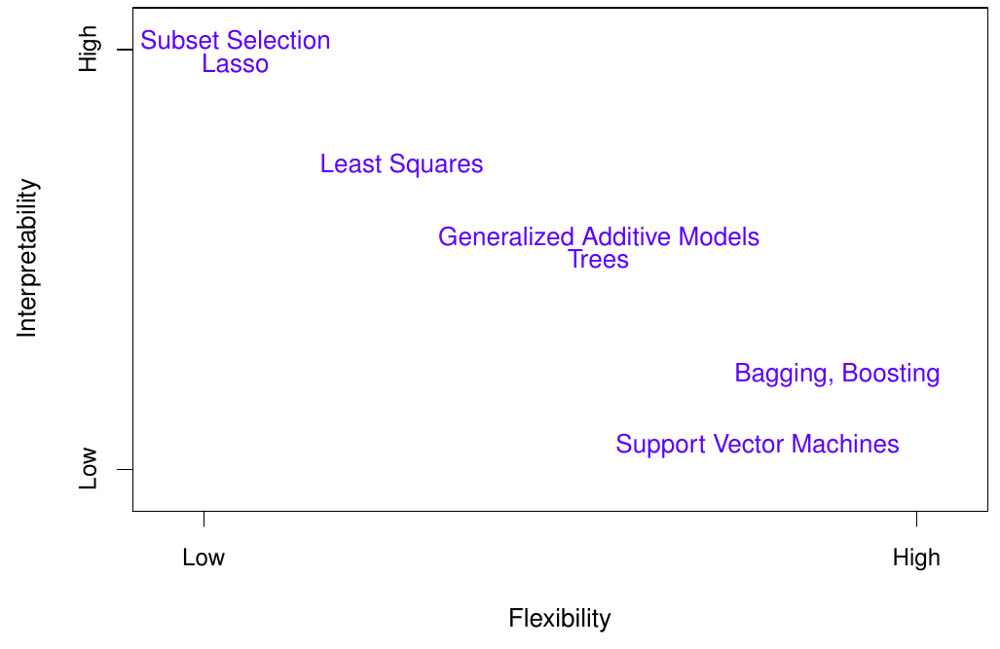
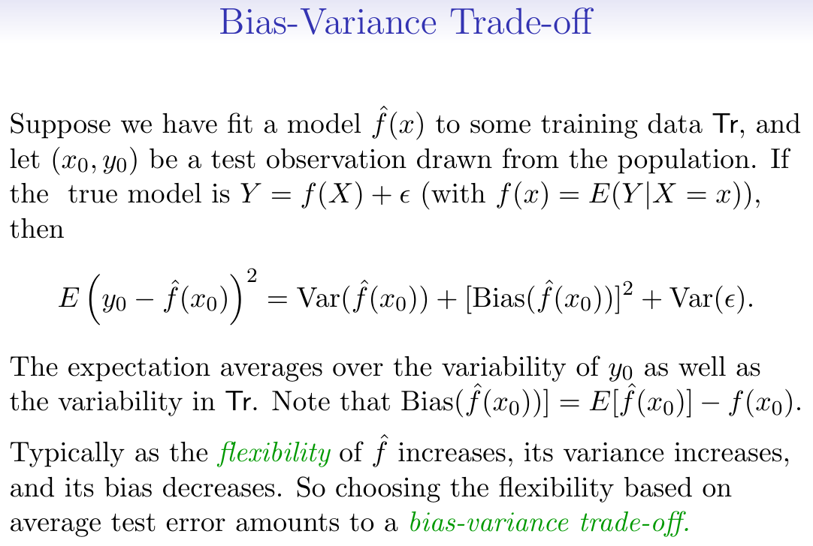

 
 \setcounter{section}{10}
 \setcounter{subsection}{2}
 \setcounter{subsubsection}{1}
 

License: [CC-BY-SA 4.0](https://creativecommons.org/licenses/by-sa/4.0/)

 <!-- 
 How to make comments inside Rmarkdown
# Script Name: My class notes template for Fall 2016
# Purpose: This is a template Rmd file to start a new class from
# Authors: Roger H. French
# License: Creative Commons Attribution-ShareAlike 4.0 International License.
##########
# Latest Changelog Entires:
# v0.00.01 - Filename.Rmd - Roger French started this blank Rmd script
-->

<!-- Or on a single line like this -->
 

```{r setup, include=FALSE}
knitr::opts_chunk$set(echo = TRUE)
```


#### Reading, Homeworks, Projects, SemProjects

  * Homework: 
    * HW6 is given out Thursday November 8th, 2018
    - Due in 1 week on Thursday November 15th, 2018
  * Readings: 
    * ISLR Chapter 3
  * Projects: We will have four 2 week EDA projects
    * Project 3 given out today, November 6th, 2018
    - Due Thursday November 20, 2018
  * 451 SemProjects:  
    * Third SemProj Report Outs Dec. 4,6 2018
    * Final full SemProject Written Report Due 12/17/2018
  * Final Exam
    * Monday December 17th, 12 noon to 3pm, Olin 313

#### Syllabus


#### ISLR Chapter 2 Regression and IntroR Lab Excerise

From Hastie and Tibshirani

  * They have good notation
  * And a good intro to R

##### Regression is the case of supervised learning

Where we have a response that is associated with the predictors

  * And we want to develop a predictive model
    - that relates predictors with response

#### Function Notation for a Predictive model

Some notation for predictive models

  * Response $Y$ which we want to predict
  * And the Predictors we will use are $X=X{_1}+X{_2}+X{_3}$
    - when we have $P$ number of predictors, 
      - and $P=3$ in this example
    - where the predictors $X$ is a vector
    - And $X$ is a column vector containing  $(X{_1},X{_2},X{_3})$
    - Which has 3 components $X{_1}+X{_2}+X{_3}$ 
    - We also have to have an error term $\epsilon$
  * Our predictive model will then be 
    - $Y = f(X) + \epsilon$ 
  * $\epsilon$ error term is a catch all
    - captures measurement error, and other discrepancies
    - we can never model something perfectly
  * And for the predictor $X$ 
    - A single instance of $X$ is $x$ 
    - i.e. $(x{_1},x{_2},x{_3})$
    - three specific values of the 3 components
    - of 1 individual observation, i.e. $x$ 
    - of the predictor $X$

##### Variables 

  * Independent Variables $X$ are called
    - independent variables
    - predictors
    - exogenous variables
  * Dependent Varialbes $Y$ are called
    - dependent variables
    - responses
    - endogenous variables
    
In some cases, such as network models

  * Some variables may be both.
    - independent, predictors
    - and also  dependent response
  * Such as in our group's netSEM structural equation models
    - take a look at SEM package
    
```{r,Echo=TRUE} 
# install.packages("sem") 
library(sem) 
help(sem) 


# install.packages("lavaan") 
library(lavaan) 
help(lavaan) 

# install.packages("netSEM")
library(netSEM) 
help(netSEM) 
```

##### Expected Values of a Predictive Model

Now, once you have a predictive model

How well does it do, fitting your actual response?

  * Remember a function is by definition single-valued 
    - for a given value $x{_1}$ of the independent variable X 
    - there is only dependent value $y{_1}$ for the dependent variable Y 
  * Therefore it can never actually predict 
    - the exact observed value of the response
  - this is why we keep the error term $\epsilon$ explicit
    
The Expected Value of a Regression Function

  * Our regression function is $Y=f(X)+\epsilon$
  * Gives the Expected value of the response for $X=4$

Notation for this is:

  $$f(4)=E(Y|X=4)$$
  
Or for our vector $X$

  $$ f(x) = f(x{_1}, x{_2}, x{_3}) = E(Y |X{_1} = x{_1}, X{_2} = x{_2}, X{_3} = x{_3})$$
  
##### The ideal or optimal predictor of Y

  * Minimizes the loss function between the function and the data
  * For example minimizing the sum of squared errors

##### An estimate (one version) of $f(X)$ 

  * is called $\hat{f}(X)$
  * since we could determine many versions of $f(X)$

And then we'll determine the best one of these $\hat{f}(X)$ functions

  * That reduces the loss function


##### And then we are left with the irreducible error

  * Which is just the variance of the errors.

##### So by better model building

  * we can reduce the reducible error
  * and we're left with the irreducible error. 
    - Which I think of as the true "noise" in the data


#### Overview of the Regression Function and its nature


##### How do we estimate the function $f(X)$?

We can perform the loss function minimization, at each specific value $x$ of $X$.

  * Or at least in the neighborhood of $x$, 
    - which is denonte by $\mathcal{N}(x)$
    - and called Nearest Neighbor Averaging

Note that the regression function $f(X)$ is not an algebraic function

  * We didn't guessestimate it should be quadratic or some such.
  * It is a numerical function defined for each value $x$ of $X$


#### The Curse of Dimensionality

When we are doing our nearest neighborhood averaging

  * in high dimensional datasets
  * we are hit by the curse of dimensionality
    - We can't define who are nearest neighbors
    - Because they tend to be far away in high dimensions
    
This hits us in many places of Prediction, Modeling and Statistical Learning

  * [The Curse of Dimensionality](https://en.wikipedia.org/wiki/Curse_of_dimensionality)

#### Parametric and Structured Models

One way to get around the curse of dimensionality,

  * Use Parametric Models

$$ f_{l}(X)=\beta_{0}+\beta_{1}X_{1}+\beta_{2}X_{2}+...\beta_{p}X_{p}$$

Where there are $p+1$ parameters in the model

  * Which are estimated by fitting the model to the data

Estimated values of a parameter $\beta$

  * are denoted as $\hat{\beta}$


##### Some tradeoffs in regression modeling

  * Prediction accuracy versus interpretability.
    - Linear models are easy to interpret; 
    - thin-plate splines are not.
  * Good fit versus over-fit or under-fit.
    - How do we know when the fit is just right?
  * Parsimony versus black-box.
    - We often prefer a simpler model 
      - involving fewer variables 
    - Over a black-box predictor 
      - involving them all.
      
##### Interpretability vs Flexibility

Here are some of the approaches we'll look at this semester

  * Simpler models could be more interpretable
    - Or could be too naive
  * Flexibility makes for good fits
    - But can lead to overfitting
    


#### Assessing Model Accuracy

##### Have to use training (Tr) and testing (Te) datasets

To determine the best predictive model


#### The Bias vs. Variance Trade-off



  * The hat is the estimated value of something. $\hat{f}(X)$
  * We can see the variance of $\hat{f}(X)$
  * And the bias in $\hat{f}(X)$
  
Choosing the flexibility of your fitting function

  * (i.e the number of predictors, or coefficients, in your model function)
  * based on average test error
  * amounts to what we call a bias-variance trade-off

And we use training datasets and testing datasets

  * which we apply our model to
  * to determine the optimal tradeoff we should use
  * for a specific problem and model


##### How does all this play out in Classification Problems

As opposed to Regression Problems, which we just discussed


#### Citations

* R Core Team. R: A Language and Environment for Statistical Computing. Vienna, Austria: [R Foundation for Statistical Computing, 2014.](http://www.R-project.org/).
* Gareth James, Daniela Witten, Trevor Hastie, and Robert Tibshirani. An Introduction to Statistical Learning: With Applications in R. 1st ed. 2013, Corr. 5th printing 2015 edition. Springer Texts in Statistics. New York: Springer, 2013.
* Abbass Al Sharif. “Applied Modern Statistical Learning Techniques.” [Abbass-Al-Sharif. Accessed January 17, 2016.(http://www.alsharif.info/).
* Diez, David M., Christopher D. Barr, and Mine Çetinkaya-Rundel. OpenIntro Statistics: Third Edition. 3 edition. S.l.: OpenIntro, Inc., 2015.
* Mayor, Eric. Learning Predictive Analytics with R. Packt Publishing - ebooks, 2015.


