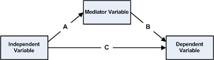
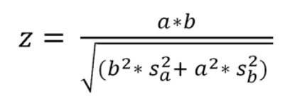

```{r setup, include=FALSE}
knitr::opts_chunk$set(echo = TRUE)
knitr::opts_chunk$set(fig.width = 6, fig.height = 4.5) 
```

 \setcounter{section}{12}
 \setcounter{subsection}{1}
 \setcounter{subsubsection}{2}
 
 <!-- 
 How to make comments inside Rmarkdown
Script Name: My class notes template for Fall 2016
Purpose: This is a template Rmd file to start a new class from
Authors: Roger H. French
License: Creative Commons Attribution-ShareAlike 4.0 International License.
##########
Latest Changelog Entires:
v0.00.01 - Filename.Rmd - Roger French started this blank Rmd script
-->

<!-- Or on a single line like this -->
 

#### Reading, Homeworks, Projects, SemProjects

  * Homework: 
    * HW6 Due Thursday, November 8th
  * Readings: 
    * ISLR4 Classification today
    * ISLR6 Lineary Model Selection and Regularization this Thursday
  * Projects: We will have four 2 week EDA projects
    * You have Proj 3
  * 451 SemProjects:  
    * Report Outs 3 In Week 15a, 15b
    * 
  * Final Exam
    * Monday  December 17th, 12 noon to 3pm, Olin 313


#### Textbooks

  - [Peng: R Programming for Data Science](https://play.google.com/books/reader?printsec=frontcover&output=reader&id=F1mVHgAAAEAJ&pg=GBS.PA1)
  - [Peng: Exploratory Data Analysis with R](https://play.google.com/books/reader?printsec=frontcover&output=reader&id=R-09BgAAAEAJ&pg=GBS.PA1)
  - [Open Intro Stats, v3](https://play.google.com/books/reader?printsec=frontcover&output=reader&id=G2EOBwAAAEAJ&pg=GBS.PA0)
  - [Wickham: R for Data Science](https://play.google.com/books/reader?printsec=frontcover&output=reader&id=I6y3DQAAQBAJ&pg=GBS.PA1)
  - [Hastie: Intro to Statistical Learning with R](https://play.google.com/books/reader?printsec=frontcover&output=reader&id=KtuPCwAAAEAJ&pg=GBS.PA0)
  
#### Syllabus


#### Multiple Regression Practicum

##### First steps in the data analysis

```{r}

library(psych)
if (!require("MASS")) install.packages("MASS")
library(MASS)
?MASS
packageDescription('MASS')
```

In what follows, we will use a dataset of 40 cases 

  - generated from a covariance matrix 
    - obtained from a subsample of real data we collected, 
  - which is about 
    - burnout components, 
    -  work satisfaction, 
    - work-family conflict, and 
    - organizational commitment 
  - in hospitals. 

There are six attributes in the dataset that we will analyze here; 

  - all are self-assessments made by nurses:
    - Commit: Commitment to their hospital (response here)
    - Exhaust: Emotional exhaustion (one of the three components of burnout)
    - Depers: Depersonalization (one of the three components of burnout)
    - Accompl: Accomplishment (one of the three components of burnout)
    - WorkSat: Work satisfaction
    - WFC: Work-family conflict

Our goal here is to understand 

  - how burnout dimensions and work satisfaction 
  - affect commitment of nurses to their hospital.

We start by 

  - generating the data and 
  -  examining the correlation table 
  - and significance. 

Make sure the matcov.txt file is in your working directory 
before running this code:

```{r}
matcov <- unlist(read.csv("./data/matcov.txt", header = F))
covs <- matrix(matcov, 6, 6)
means <- c(4.47,14.95,4.87,36.08,5,1.88) 
set.seed(987)
nurses <- data.frame(mvrnorm(n = 40, means, covs))
colnames(nurses) <- c("Commit","Exhaus","Depers","Accompl",
                    "WorkSat","WFC")
corr.test(nurses)
```

The values with a probability value lower than 0.05 

  - are significant by common standards. 
  
We can see, for instance, that, in this subsample, 

  - commitment is significantly correlated 
    - with exhaustion, work satisfaction, and work-family conflict,
  - but not with depersonalization and accomplishment. 
  
We can also see that the predictors are intercorrelated—

  - that is, they share part of their variance. 
  
We will examine whether this constitutes a problem 

  - for a regression analysis later.

Let's plot the relationship 

  - to see if the relationships indeed seem linear:

```{r}
plot(nurses)
```

Here, we will only comment on the scatterplots in which commitment is included.

We can see that there is visibly 

  - a negative linear association 
    - between commitment and exhaustion and work-family conflict. 
  - There is visibly a positive linear relationship 
    - between commitment and work satisfaction. 
  - Notice that there are also other relations visible on the plots, 
    - such as the visible relation between work-  family conflict and exhaustion. 
  - From these scatterplots, 
    - nothing in the data seems problematic for the relationships we are exploring.


#### Performing the multiple linear regression

We want to know if there is a relationship 

  - between our predictors and the response.

We first want to know 

  - whether the three burnout dimensions 
  - predict commitment to the hospital.

We create the model by 

  - using the formula syntax 
    - as an argument in the lm() function. 
  - What is on the left of the tilde (~) sign 
    - is the response, 
  - on the right are the predictors, 
    - separated by a plus (+) sign:

Let's examine 

  - the coefficients 
  - and their significance 
  - in the summary of the model:

```{r}
model1 <- lm(Commit ~ Exhaus + Depers + Accompl, data = nurses)
```

The following output shows 

  - that exhaustion and accomplishment 
    - are predictors of commitment to the hospital 
    - (look at p-value under Pr(<|t|) or refer to *) 
  - exhaustion negatively 
    - (more emotionally exhausted people are less committed)
  - and accomplishment positively 
    - (more accomplished people are more committed):
  
```{r}
summary(model1)
```


#### Checking for the normality of residuals

We have seen that it is important 

  - that residuals are normally distributed. 

We can do this visually by plotting, as in the following line of code:

```{r}
hist(resid(model1), main = "Histogram of residuals", 
     xlab = "Residuals")
```

From the preceding output, we might suspect 

  - a slight deviation from normality.


The [Shapiro-Wilk test](https://en.wikipedia.org/wiki/Shapiro%E2%80%93Wilk_test) 

  - is a test of normality in frequentist statistics


```{r}
shapiro.test(resid(model1))
```

We can also see that 

  - the p-value for F-statistic is significant (bottom of the output), and 
  - that 55 percent of variance (see Multiple R-squared) is predicted. 
  
The adjusted R-squared 

  - considers the number of predictors 
  - in the calculation of its value. 
  
It is recommended that you specify 

  - which value you use when reporting the results, 
  - or you can also report both values. 

Here, we can see that 

  - Adjusted R-squared is just a bit lower than Multiple R-squared, 
  - meaning that the results are not much affected
    - by the number of predictors.


#### Checking for variance inflation

We also want to check whether 

  - there is a problem of variance inflation 
  - in our analysis
    - that is, whether the predictors are correlated a lot (multicollinear). 
  - For this purpose, we will rely on the vif() function of the HH package. 
    - he function takes the lm formula as an argument:

```{r}
# if (!require("HH")) install.packages("HH")
# install.packages("gmp")
# install.packages("Rmpfr")
# install.packages("HH")
# library(HH)
# vif(Commit ~ Exhaus + Depers + Accompl, data = nurses)
```

There are several rules-of-thumb to assess this. 

  - One is to consider vif values higher than 10 to be problematic, 
  - another is to consider a predictor as problematic 
    - if the square root of the vif value is higher than 2. 
  - This is not the case here, 
    - therefore, we consider our data to be non-multicollinear here.


#### Examining potential mediations and comparing models

Let's now examine whether 

  - including work-family conflict and work satisfaction
  - permits to predict an additional part of variance. 
  
We first will ask R to fit a second model, and 

  - then will compare model1 and model2 using the anova() function:

```{r}
model2 <- lm(Commit ~ Exhaus + Depers + Accompl + WorkSat, 
            data = nurses)
```

The following output shows that 

  - indeed the second model predicts additional variance 
    - in comparison to model1 
  - (see the significance of the F statistic for the comparison (under Pr(>F)):

```{r}
anova(model1,model2)
```

We will now examine the second model, 

  - as the additional variance predicted is significantly different from 0:

```{r}
summary(model2)
```

This model predicts 70 percent of variance in commitment, 

  - which is pretty good. 
  
We can see that work satisfaction 

  - is a significant predictor of commitment to the hospital,
  - that the unique contribution of accomplishment is no longer significant 
    - (there is therefore a potential mediation), 
  - and that the contribution of exhaustion 
    - has been reduced when including work satisfaction in the model 
    - (there is therefore a potential partial mediation). 
  - This might be because of a mediation of the relationship 
    - between the two burnout components 
    - and commitment by job satisfaction. 

What is [Mediation](https://en.wikipedia.org/wiki/Mediation_(statistics))?

  - In statistics, a mediation model is 
    - one that seeks to identify and explain the mechanism or process 
    - that underlies an observed relationship between 
    - an independent variable and a dependent variable 
    - via the inclusion of a third hypothetical variable, 
    - known as a mediator variable (also a mediating variable, intermediary



Let's test this relationship:

```{r}
model3 <- lm(WorkSat ~ Exhaus + Depers + Accompl, data = nurses)
summary(model3)
```

We can notice that 

  - 51 percent of the variance of job satisfaction 
  - is predicted by the burnout components. 

All three burnout components 

  - are significantly related to work satisfaction (p < .05), 
  - negatively for emotional exhaustion and depersonalization 
  - and positively for personal accomplishment.

In order to ascertain mediation, 

  - we need to proceed to [Sobel tests](https://en.wikipedia.org/wiki/Sobel_test). 
  - The bda package contains the necessary function, 
    - called mediation.test(). 

The Sobel Test

  - is basically a specialized t test 
    - that provides a method to determine whether the reduction 
    - in the effect of the independent variable, 
    - after including the mediator in the model, 
    - is a significant reduction and 
  - therefore whether the mediation effect is statistically significant.
    
Let's try to see whether the effect of exhaustion on commitment 

  - is mediated by work satisfaction:

```{r}
if (!require("bda")) install.packages("bda")
library(bda)
mediation.test(nurses$WorkSat,nurses$Exhaus,nurses$Commit)
```

In the following output, under Sobel, 

  - we can see that p.value is significant, 
  - as the presence of work satisfaction in the model 
    - decreases the effect of exhaustion, 
  - that work satisfaction is significant 
    - even though exhaustion is present in the model,
  - and that, because the Sobel test is significant, 
    - we can confirm that there is indeed 
    - a partial mediation of the effect of exhaustion 
    - on commitment by work satisfaction. 
    
In other words, 

  - exhaustion decreases work satisfaction, 
  - and in turn, work satisfaction increases commitment.

The value resulting from the Sobel test follows a z distribution. 

In order to obtain this value, 

  - the slope coefficients of the predictor regressed on the mediator (a) 
    - are multiplied by the slope coefficient of the mediator 
      - regressed on the response (b). 

This value is then divided by the square root of b squared 

  - multiplied by the squared standard error of a 
  - plus a squared multiplied by the squared standard error of b.
The formula is as follows:


  
Showing this is important, as very often, 

  - analysts include dozens or hundreds of predictors in their models 
  - without taking into consideration that the included predictors 
    - could themselves be related to each other. 

Readers are therefore advised to check 

  - for meaningful relationships between the attributes 
  - they intend to include as predictors in regression analyses 
  - before drawing conclusions on the final model!

#### Predicting new data

A particularly interesting use of regression 

  - is to examine how well a model predicts new data. 

This is easily achieved in R. 

We will first build the dataset named nurses2 

  - in the same way we did for the first dataset:
  
```{r}
matcov2 <- unlist(read.csv("./data/matcov2.txt", header = F))
covs2 <- matrix(matcov2, 6, 6)
means2 <- c(4.279, 13.152, 5.156, 39.28, 5.153, 1.875)
set.seed(987)
nurses2 <- data.frame(mvrnorm(n = 40, means2, covs2))
colnames(nurses2) <- c("Commit","Exhaus","Depers","Accompl",
                     "WorkSat","WFC")
predicted <- predict.lm(model1, nurses2)
```

The following output shows that the correlation 

  - between the predicted values 
  - and the real values is 0.5766194. 
  
This value is significant and might seem pretty good at first sight:
  
```{r}
cor.test(predicted, nurses2$Commit)
```

Let's square this value 

  - to know how much of the variance in the commitment of the individuals 
  - of the second sample is predicted by the model:

The output is 33.24899. 

This means only 33 percent of the variance in commitment

  - is predicted by the model, 
  - compared to 55 percent in the training data!

Now, we can also compute the residuals:

```{r}
residuals_test <- nurses2$Commit - predicted
```

We are now able to compute the F value for our model. 

[Statistical Tests](https://en.wikipedia.org/wiki/Test_statistic)

[$t$-statistic](https://en.wikipedia.org/wiki/T-statistic)

[$F$-test](https://en.wikipedia.org/wiki/F-test)

We have seen that the $F$ value is used 

  -  to assess the overall significance of the model. 
  
In our case, the $F$ value is obtained as follows:

1) First, we need to know the number of degrees of freedom for the model; 

  - this is equal to the number of predictors we have, which is 3. 
  - We also need the degrees of freedom for the error; 
    - this is the number of observations 
    - minus the degrees of freedom of the model, minus 1.

2) We then compute the sum of squares for the model 

  - as the sum of squared differences 
    - between the predicted values 
    - and the mean of the response. 

The sum of squares for the error is obtained as 

  - the sum of the squared differences 
  - between the observed and the predicted values.

3) We then compute the mean squares for the model 

  - as the sum of squares for the model 
  - divided by the degrees of freedom for the model. 

We compute the mean squares for the error 

  - as the sum of squares for the error 
  - divided by the degrees of freedom for the error.

4) Finally, we obtain the $F$-statistic 

  - by dividing the means squares for the model
  - by the mean squares for the error. 

The following function does just that:
  
```{r}
ComputeF <- function(predicted, observed, npred) {
  DFModel <- npred  # the number of predictors
  DFError <- length(observed) - DFModel - 1
  SSModel <- sum((predicted - mean(observed))^2)
  SSError <- sum((observed - predicted)^2)
  MSModel <- SSModel / DFModel
  MSError <- SSError / DFError
  F <- MSModel / MSError 
  F
}

ComputeF(unlist(model1[5]), nurses$Commit, 3)
ComputeF(predicted, nurses2$Commit, 3)
```

The outputted $F$ value is 10.4842.

We can test this value using the following line of code. 

The output shows that the threshold $F$ value 

  - at a ceiling of 0.05 on the F distribution for our model is 2.866266:
  
```{r}
qf(.95, df1 = 3, df2 = 36) 
```

We can therefore, trust that our model significantly predicts new data.


#### [Robust regression](https://en.wikipedia.org/wiki/Robust_regression)

In the example datasets that we used in this section, 

  - we have seen that some observations might threaten 
  - the reliability of our results, 
    - because of the deviations of their residuals from a normal distribution. 

The [Shapiro-Wilk test](https://en.wikipedia.org/wiki/Shapiro%E2%80%93Wilk_test) performed on the
residuals of model1 (nurses dataset) 

  - has shown that the distribution of the residuals
  - was not significantly different from a normal distribution. 
  
However, let's be particularly cautious 

  - and analyze the same data using robust regression.

As we mentioned earlier, robust regression 

  - does not require the residuals to be normally distributed, 
  - and therefore, fits our purpose. 

We will not explore the algorithm. 

  - For details about this, the reader can consult 
    - Robust Regression in R by Fox and Weisberg, in readings.
  - Here, we simply perform robust regression using the rlm() function 
    -  of the MASS package. 
    
Let's first install and load it:
  
```{r}
model1.rr <- rlm(Commit ~ Exhaus + Depers + Accompl, data = nurses)
summary(model1.rr)
```

You might notice that the output of rlm() is laconical 

  - in comparison to the output of lm(). 
  - There are no p-values provided, no R-squared values, no F test. 

This makes the use of rlm() quite unpractical, 

  - as the user will have to compute them by hand.

There is so much controversy on how to do it 

  - that the computations in other software packages are currently questioned! 
  
The reader interested in computing the robust R-squared 

  - can read the paper 
    - [A robust coefficient of determination for regression](http://dx.doi.org/10.1016/j.jspi.2010.01.008) 
    - by Renaud and Victoria-Feser (2010), which is in readings.
    
For our example, 

  - it seems that the results using lm() and rlm() are pretty similar
  - (see the output of the preceding summary of model1). 
  
Therefore, relying on lm() is advised here. 

However, if you want to be really sure, 

  - why not try bootstrapping.


#### Bootstrapping (Advanced topic)

The bootstrap is covered in ISLR Chapter 5 Resampling Methods, in Section 5.2.

The principle of (nonparametric) bootstrapping 

  - is to create a number of sample K of size N 
    - drawn with replacement from the original sample, 
  - where N is the original sample size. 
  
The parameters are estimated for each sample separately. 

This allows computing their confidence intervals, 

  - a measure of the variability of the parameters.
  
Apart from making deviations from normal distributions less problematic, 

  - using bootstrapping is useful for samples 
  - that have a small number of observations 
    - (less than 100), as with ours.

Bootstrapping is easily performed using several functions in R

  - for instance, the boot() function in the boot package. 
  
But let's have a little fun and perform bootstrapping ourselves, 2,000 times. 

We will first generate the samples and obtain the estimates. 

We then display the estimates for the first six samples 

  - (rounded to the third decimal place):

```{r}
ret <- data.frame(matrix(nrow = 0, ncol = 6))
set.seed(567)
for (i in 1:2000) {
  data <- nurses[sample(nrow(nurses), 40, replace = T),]
  model_i <- lm(Commit ~ Exhaus + Depers + Accompl, 
                data = data)
  ret <- rbind(ret,c(coef(model_i),summary(model_i)$r.square, 
                    summary(model_i)$fstatistic[1]))
} 
names(ret) <- c("Intercept","Exhaus","Depers",
               "Accomp","R2","F")
round(head(ret), 3)

set.seed(567)
sample(nrow(nurses), 40, replace = T)
qnorm(0.975)
CIs <- data.frame(matrix(nrow = ncol(ret), ncol = 2))
for (j in 1:ncol(ret)) {
  M <- mean(ret[,j])
  SD <- sd(ret[,j])
  lowerb <- M - (1.96 * (SD / sqrt(2000)))
  upperb <- M + (1.96 * (SD / sqrt(2000)))  
  CIs[j,1] <- round(lowerb,3)
  CIs[j,2] <- round(upperb,3)
}
names(CIs) <- c("95% C.I.lower bound", "95% C.I.upper bound")
rownames(CIs) <- colnames(ret)
CIs
```

The confidence intervals 

  - encompass all the values 
  - between the lower and upper bounds. 
  
We can see that no confidence interval contains 0, 

  - meaning that, with a 95 percent threshold, 
  - values reported are statistically different from 0 
    - (more correctly put, there is only a 5 percent chance 
    - of observing values inside these bounds 
    - if the true value of the parameters in the population is 0). 

So we conclude that 

  - bootstrapped coefficients are different from 0, 
  - as is the multiple R-squared value.
  
As you might have noticed, 

  - the value to which to compare the confidence intervals for F is not 0, 
  - but a value that depends upon the degrees of freedom. 
  
We computed this value earlier and it was 2.866266. 

As the confidence interval for F does not include this value, 

  - we can be assured that the bootstrapped model 
  - predicts a significant part of variance.


#### Summary

We examined how to develop functions 

  - that perform simple regression analyses, 
  - and how to multiply regression in R 
  - using a real life example.
  
We have examined the importance of significance tests for regression, 

  - and have briefly discussed 
    - robust regression 
    - and bootstrapping. 
    
Note that, when data about the predictors and the response 

  - are collected simultaneously, 
  - causation cannot be established. 

In order to ascertain causation, 

  - data must be collected longitudinally
  - that is, the predictors before the response.


#### Links

##### Learning Predictive Analytics with R, Eric Mayor, Packtpub 2015


