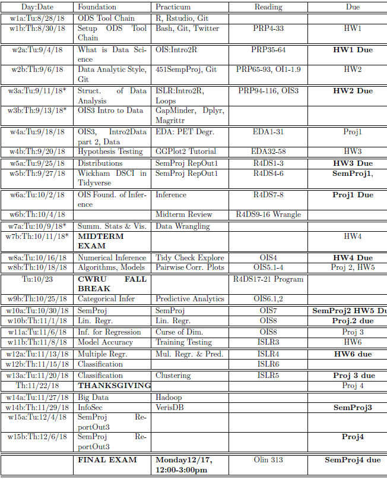
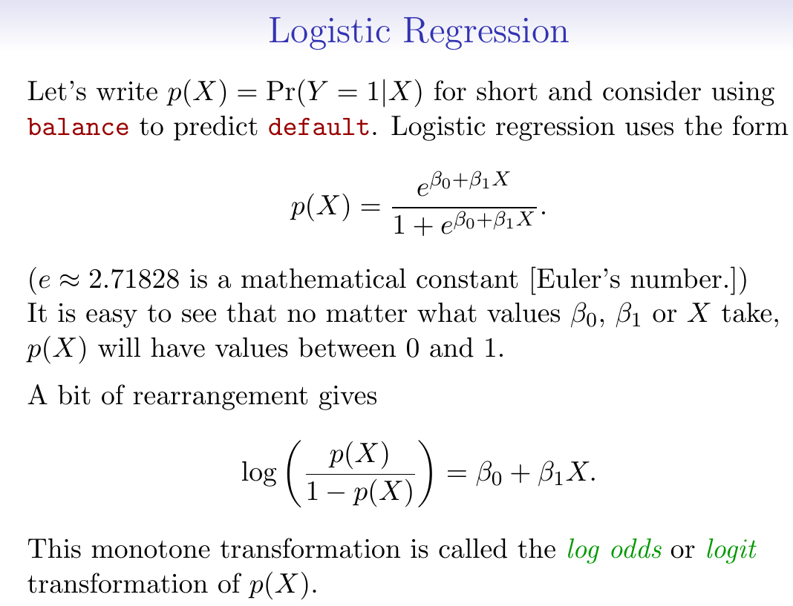
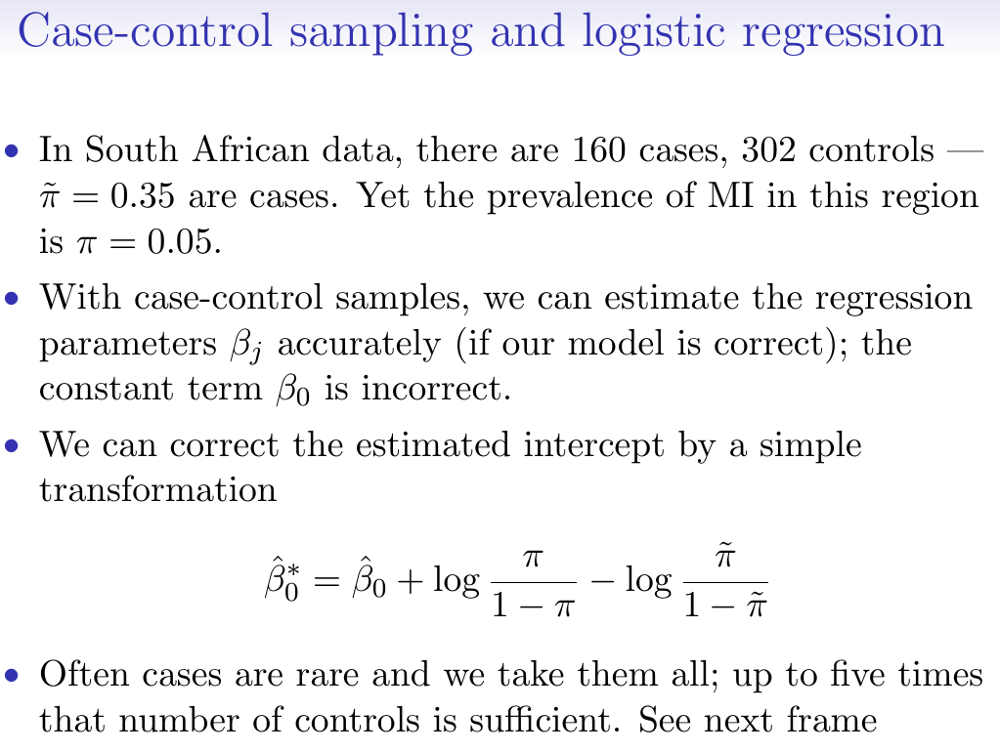
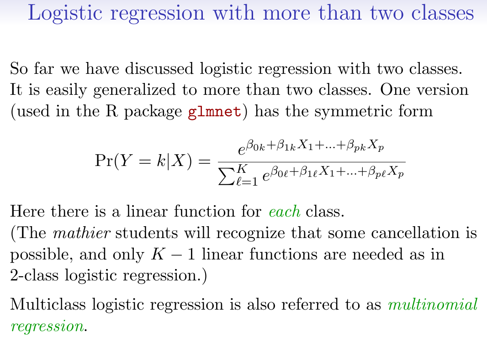
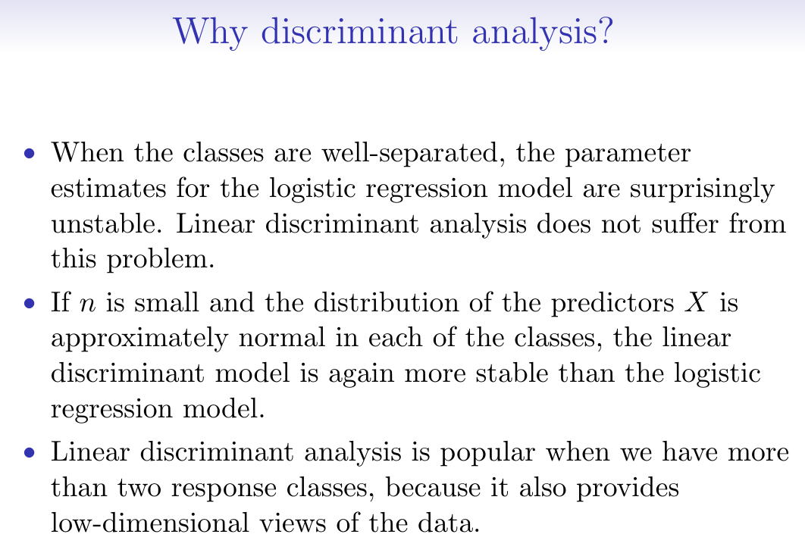

```{r setup, include=FALSE}
knitr::opts_chunk$set(echo = TRUE) 
knitr::opts_chunk$set(fig.width = 5, fig.height = 4) 
```

 \setcounter{section}{13}
 \setcounter{subsection}{1}
 \setcounter{subsubsection}{1}
 
#### Reading, Homeworks, Projects, SemProjects

  * Homework: 
    * all done
  * Readings: 
    * ISLR 6 on Linear Model Selection
    * ISLR 5 on Resampling: Cross-validation and Bootstrap
  * Projects: We will have four 2 week EDA projects
    * Project 3 due today
    - Project 4 given out thursday
    - Project 4 due Thursday December 6th
  * 451 SemProjects:  
    * Report Outs 3 In Week 15a, 15b
    - December 4th and December 6th

#### Syllabus




#### ISLR Chapter 4 Classification

Unsupervised learning example

* Classifying things into two cateogories
    - eye color {brown, blue, green}
    - email {spam, ham}.

Can we use linear regression for classification problems?

For binary classification, linear regression does a decent job.

This is called [linear discriminant analysis](https://en.wikipedia.org/wiki/Linear_discriminant_analysis)

##### Expected Values

Conditional mean of $Y$ given $X=x$. 

  + $E(Y|X=x) = Pr(Y=1|X=x)$

[Expected Value](https://en.wikipedia.org/wiki/Expected_value)

In probability theory, the expected value of a random variable, - intuitively, 

  - is the long-run average value of repetitions of the experiment it represents. 
  
For example, the expected value in rolling a six-sided die 

  - is 3.5, 
    - because the average of all the numbers 
    - that come up in an extremely large number of rolls 
    - is close to 3.5. 


Caption: An illustration of the convergence of sequence averages of rolls of a die to the expected value of 3.5 as the number of rolls (trials) grows.


Less roughly, the law of large numbers states 

  - that the arithmetic mean of the values 
  - almost surely converges to the expected value 
    - as the number of repetitions approaches infinity. 

#### [Logistic Regression](https://en.wikipedia.org/wiki/Logistic_regression)

Linear regression can produce probabilities less than 0 or greater than 0

Instead Logistic Regression is more appropriate.

Cateogorical problems. 

  * Linear regression is not appropriate. 
  * Multi-class logistic regression is better. 

Similar to encoding levels of cateogorical variables 

  - into a series of bits that each have only two levels.


Logistic Regression

  + $p(X) = (e^{(\beta_0 + \beta_1 X)} / (1+e^{(\beta_0 + \beta_1 X)}))$

Monotone transformation gives us a logarithmic ln function

  + $log (p(X)/(1-p(X))) = \beta_0 + \beta_1(X)$

[note in R, $log$ is the natural log $ln$]

This is the "log odds" or the logit transformation of $p(X)$

[Maximum Likelihood](https://en.wikipedia.org/wiki/Maximum_likelihood) (Ronald Fisher)  

Use Maximum Likelihood to estimate the parameters of the Logistic Regression model.

Using the glm package, as opposed to the lm package. 



And if you have multiple predictors and 1 categorical response, 

  * you can do multiple logistic regression, 
  * as a simple extension.


##### [Rule of Ten](https://en.wikipedia.org/wiki/Logistic_regression#%22Rule_of_Ten%22)

A widely used rule of thumb, the "one in ten rule", 

  - states that logistic regression models 
    - give stable values for the explanatory variables 
  - if based on a minimum of about 10 events per explanatory variable (EPV); 
    - where event denotes the cases belonging to 
    - the less frequent category in the dependent variable. 
    
Thus a study designed to use $k$ explanatory variables for an event 

  - (e.g. myocardial infarction) 
    - expected to occur in a proportion $p$ of participants in the study 
    - will require a total of $10k/p$ participants. 
    
However, there is considerable debate about the reliability of this rule, 

  - which is based on simulation studies 
  - and lacks a secure theoretical underpinning.


#### Case Control Sampling

In epidemiology, you always want to use the cases of the disease, 

  - while then sampling from your control group.

The prevalence of disease in your study group (your sample) 

  - may be larger than in the population at large



So the probabilty of disease in you study sample 

  - (as opposed to the true population you pulled your sample from ) 
  - might mean your logistic regression model is wrong.

Instead it turns out that only the $\beta_0$ term, 

  - the intercept will be wrong, 
  - the slopes will be right.

So you can correct the slope to represent the actual prevalence in your real population. 

  + $\tilde{\pi}$ is the apparent risk of disease in your study sample
  + while $\pi$ is the actual risk of disease in the larger population


##### Diminishing returns in unbalanced binary data


This means that you don't get alot of 1's (the disease) 

  - if you use unbiased sampling from the larger population.

So you can do "control to cases ratio"  

  - If you have a sparse cases, 
  - you can sample to account for this 


#### Multi-class Logistic Regression

If you have multiple categorical responses 

  - then you use multi-class logistic regregression.

And here you use glmnet package




#### Discriminant Analysis

A different form of classification analysis.

Model the distribution of $X$ in each of your classes $Y$.

Then use Bayes theorem to flip around and get $Pr(Y|X)$

You can get $Pr(Y=k|X=x)$ by knowing $Pr(X=x|Y=k)$ and adding in "priors"

  + $Pr(Y=k)$ is called the marginal probability or prior probability of $Y=k$
  + And you have the marginal probability of $Pr(X=x)$


Logistic regression works well when you don't have strong predictors, 

  * i.e. for very complex systems with lots of predictors and interactions

Discriminant analysis is bettter used 

  * for cases where the classes are well separated and predictors are strong.



  + $\mu_k$ is the mean in class k
  + $\sigma_k^2$ is the variance in class k


#### Notation Sidebar

We have equations 

  + For models The $Y$'s $X$'s, 
  + The values of predictors $x_i$ and $y_i$'s, 
  + The expected values of responses $\hat{y}$

We have the lm model notation. 

We have 

  + $\mu$ is means, 
  + $\sigma^2$ are variances, 
  + $\pi$ are probabilities


  


