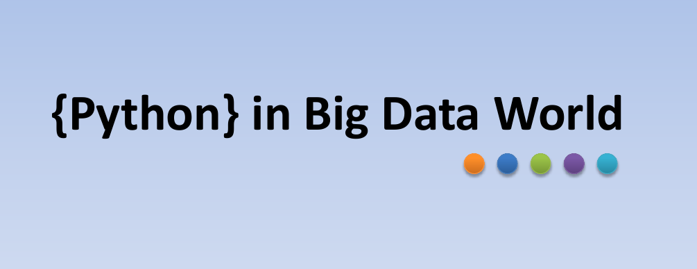
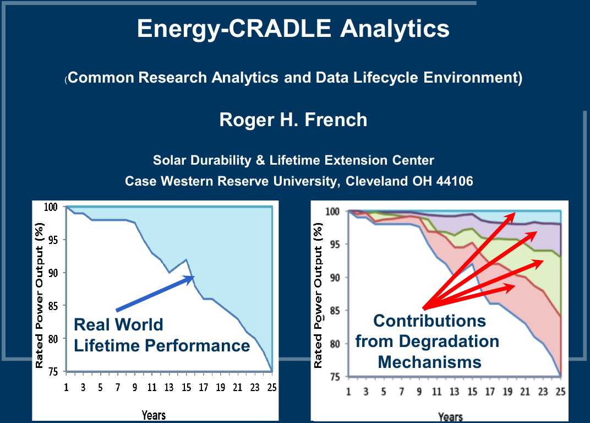

 
 \setcounter{section}{14}
 \setcounter{subsection}{1}
 \setcounter{subsubsection}{2}
 
 <!-- 
 How to make comments inside Rmarkdown
# Script Name: My class notes template for Fall 2016
# Purpose: This is a template Rmd file to start a new class from
# Authors: Roger H. French
# License: Creative Commons Attribution-ShareAlike 4.0 International License.
##########
# Latest Changelog Entires:
# v0.00.01 - Filename.Rmd - Roger French started this blank Rmd script
-->

<!-- Or on a single line like this -->
 

```{r setup, include=FALSE}
knitr::opts_chunk$set(echo = TRUE)
```


#### Reading, Homeworks, Projects, SemProjects

  * Homework: 
    * All Done
  * Readings: 
    * 
  * Projects: We will have four 2 week EDA projects
    * Project 4, Samsung Sensor Machine Learning
    - Due Thursday Dec. 6th
  * 451 SemProjects:  
    * Turn in short summary of SemProj expected outcomes
    - Report Outs 3 next week 15a 15b

#### Syllabus


#### Hadoop and Big-Data Analytics

#### 3 Seminal Papers from Google

##### Google File System

Copies of these papers are in your readings folder of your Repo.

  - Ghemawat, S., Gobioff, H., Leung, S.-T., 2003. The Google file system. ACM SIGOPS Operating Systems Review 37, 29–43. [doi:10.1145/1165389.945450](http://dx.doi.org/10.1145/1165389.945450)
  - [Google File System](../3-readings/4-Hadoop/Ghemawatetal-2003-TheGooglefilesystem.pdf)
  
##### MapReduce

  - Dean, J., Ghemawat, S., 2004. MapReduce: Simplified Data Processing on Large Clusters. Communications of the ACM 51, 107–113. [doi:10.1145/1327452.1327492](http://dx.doi.org/10.1145/1327452.1327492)
  - [Google File System]("../3-readings/4-Hadoop/DeanandGhemawat-2004-MapReduceSimplifiedDataProcessingonLargeClu.pdf")
  
##### BigTable

  - Chang, F., Dean, J., Ghemawat, S., Hsieh, W.C., Wallach, D.A., Burrows, M., Chandra, T., Fikes, A., Gruber, R.E., 2006. Bigtable: A Distributed Storage System for Structured Data. ACM Transactions on Computer Systems (TOCS) 26, 1–26. [doi:10.1145/1365815.1365816](10.1145/1365815.1365816)
  - [BigTable]("../3-readings/4-Hadoop/Changetal-2006-BigtableADistributedStorageSystemforStructu.pdf")

#### Lets get introduced to the concepts

##### Hadoop/MapReduce
[Hadoop/MapReduce](1808-351-351m-451-w14a-f-A-hadoop1.pdf)


##### Intro Hadoop
[Intro Hadoop](1808-351-351m-451-w14a-f-B-bigbigbigdata.pdf)


##### Python in a Big Data World
[Python in a bid data world](1808-351-351m-451-w14a-f-C-pythoninbigdataworld.pdf)



##### Hadoop/Hbase: Energy-CRADLE for Energy Analytics
[Energy Cradle](1808-351-351m-451-w14a-f-D-ECRADLE.pdf)



[NoSQL Data Warehouse and Analytics Environment](../3-readings/4-Hadoop/Huetal-2017-ANonrelationalDataWarehousefortheAnalysisof.pdf)


##### SPARK for stream processing (In RAM)

[Apache Spark Tutorials](http://spark.apache.org/documentation.html)

#### Citations


***